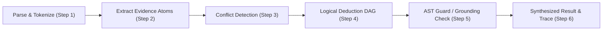

# PAI Native Symbolic Reasoning Engine — Specification & Architecture

**Document Version:** 1.0.0  
**Status:** Research Track Specification (Option B; ADR-001 & ADR-007)  
**Target Environment:** Stateless Python/Rust Pure Reasoning Core  

---

## 1. Overview & Architectural Motivation

The **PAI Native Symbolic Reasoning Engine** is a deterministic, knowledge-free, and stateless reasoning architecture. Unlike large neural language models (LLMs) that store vast factual corpora inside tens of billions of dense matrix weights, this engine operates on strict formal logic principles:

1. **Stateless Ephemeral Execution**: Operates exclusively in ephemeral memory with zero persistent weights or weights-derived knowledge bases. All working memory is zeroized post-task.
2. **Deterministic Grounding**: Claims are deduced exclusively from explicit, fenced external context ingested through the SSRF-guarded network pipeline or user input.
3. **Formal Invariant Verification**: Deductive reasoning and code generation steps are bounded by dynamic hardware budgets, validated through an Abstract Syntax Tree (AST) guard, and checked for contradictions.

This specification defines the formal evidence atom schema, conflict resolution logic, DAG execution engine, grounding validation, and the six non-negotiable operational invariants (I1–I6).

---

## 2. Core Data Models

### 2.1 Evidence Atom Schema

An **Evidence Atom** represents the smallest indivisible, falsifiable proposition extracted from fenced context. It maps directly to an extended semantic triple with provenance and trust metadata:

$$\text{Atom} = \langle \text{id}, S, P, O, \text{polarity}, \tau, t, \text{raw\_text} \rangle$$

Where:
* **`id` (str)**: Unique alphanumeric identifier (e.g., `ATOM-001`).
* **`subject` ($S$, str)**: The entity or subject under consideration (normalized lowercase).
* **`predicate` ($P$, str)**: The relational verb or property (e.g., `is_a`, `implements`, `requires`, `conflicts_with`).
* **`object` ($O$, str)**: The target entity, value, or attribute.
* **`polarity` ($\text{bool}$)**: `True` if positive assertion ($S \text{ has } P(O)$); `False` if negated assertion ($\neg [S \text{ has } P(O)]$).
* **`source_trust` ($\tau \in [0.0, 1.0]$)**: Trust weight assigned to the originating data stream.
  * Ingested web data (sanitized): $\tau \in [0.3, 0.7]$ based on domain repute.
  * Direct user instruction: $\tau = 0.9$.
  * Constitution / System policy: $\tau = 1.0$.
* **`timestamp` ($t$, float/ISO-8601)**: Ingestion timestamp for freshness evaluation.
* **`raw_text` (str)**: Verbatim context snippet from which the atom was parsed.

```python
@dataclass(frozen=True)
class EvidenceAtom:
    atom_id: str
    subject: str
    predicate: str
    object: str
    polarity: bool = True
    source_trust: float = 0.5
    timestamp: float = 0.0
    raw_text: str = ""
```

---

## 3. Conflict Detection & Dialectic Resolution

When external sources provide conflicting information, the engine must never silently blend them or hallucinate an arbitrary reconciliation. 

### 3.1 Conflict Conditions

A conflict between $\text{Atom}_A$ and $\text{Atom}_B$ is triggered if:
1. **Direct Negation**: $S_A = S_B \land P_A = P_B \land O_A = O_B \land \text{polarity}_A \neq \text{polarity}_B$.
2. **Functional Predicate Inconsistency**: Predicates defined as *functional* (e.g., `has_capital`, `created_in_year`) cannot have multiple distinct objects for the same subject:
   $$S_A = S_B \land P_A = P_B \land O_A \neq O_B \land \text{is\_functional}(P_A)$$

### 3.2 Resolution Strategy

1. **Trust Delta Resolution ($\Delta \tau > \epsilon$)**: If $|\tau_A - \tau_B| \ge 0.20$, the atom with the higher trust score is adopted as the active premise. The weaker atom is demoted to an archived counter-claim.
2. **Unresolved Contradiction ($\Delta \tau < \epsilon$)**: If trust scores are comparable, the conflict is explicitly flagged as `UNRESOLVED_CONTRADICTION`. The engine refrains from asserting either premise as absolute fact and explicitly documents the dialectic tension in the reasoning output.

---

## 4. Bounded DAG Execution Engine

The reasoning process is modeled as an **Execution Graph (Directed Acyclic Graph)** where each node represents a pure, deterministically computable transformation.



### 4.1 Node Types & Operations

| Node Operation | Input | Output | Purpose |
|----------------|-------|--------|---------|
| `PARSE_INPUT` | Query string | Intent, Target Language, Entity list | Extracts syntactic targets |
| `EXTRACT_ATOMS` | Fenced context | `List[EvidenceAtom]` | Decomposes text into atomic semantic triples |
| `DETECT_CONFLICTS` | `List[EvidenceAtom]` | `ConflictReport` | Identifies and resolves contradictory premises |
| `DEDUCE_RELATIONS` | Active Atoms, Query | Logical deductions | Applies transitive & deductive inference rules |
| `SYNTHESIZE_CODE` | Intent, Rules, Constraints | Source code | Synthesizes verified algorithms |
| `GROUNDING_AUDIT` | Synthesized text, Active Atoms | Grounding score, citation map | Verifies all output claims against atoms |

### 4.2 Hardware Tier Containment

The DAG execution is bounded strictly by `HardwareBudget`:
* **COMPRESSED Tier** ($\le 4\text{ GB RAM or low battery}$):
  * Execution Depth Cap: 3 nodes.
  * Concurrency: strictly single-threaded (sequential).
  * Direct synthesis mode; deep deductive branching disabled.
* **BALANCED Tier** ($4\text{ to }16\text{ GB RAM}$):
  * Execution Depth Cap: 6 nodes.
  * Concurrency: bounded by `thread_pool_limit` (typically 2 threads).
  * Full dialectic conflict detection and deductive synthesis.
* **HIGH Tier** ($> 16\text{ GB RAM on AC power}$):
  * Execution Depth Cap: 10 nodes.
  * Concurrency: bounded by CPU core count / 2.
  * Deep multi-step verification and alternative derivation paths.

---

## 5. Strict Grounding Validator

Every synthesized explanation or logical deduction must be verified by the `GroundingValidator` before being returned to the caller:

1. **Citation Parsing**: The synthesized output must explicitly cite supporting evidence atoms using the notation `[ATOM-id]`.
2. **Citation Validation**:
   - Each cited atom must exist in the active atom set.
   - The cited atom must not be marked as an unresolvable contradiction.
   - The predicate and object asserted in the synthesized text must match the atom's semantics.
3. **Ungrounded Detection**:
   - Any claim or statement in the output lacking an evidence atom citation is flagged as `UNGROUNDED`.
   - If an output contains zero grounded citations, its overall status is labeled `UNGROUNDED (heuristic baseline only)`.

---

## 6. System Invariants (I1 – I6)

The reasoning engine must continuously uphold six core invariants under all operating conditions:

* **I1 — Strict Grounding Invariant**: The engine shall never present an ungrounded assertion as a verified external fact. Any statement derived from fundamental syntactic rules rather than ingested evidence must be explicitly labeled `UNGROUNDED`.
* **I2 — Deterministic Termination**: Graph execution is provably acyclic. Total execution steps cannot exceed the budget's maximum depth ceiling, ensuring the engine halts deterministically under any input.
* **I3 — Budget Containment**: Concurrency, memory allocations, and evaluation time strictly honor the active `HardwareBudget` parameters. No thread spawning or buffer allocation beyond budget limits is permitted.
* **I4 — Ephemeral Purge Invariant**: Immediately upon task completion or upon encountering an error, all working graphs, temporary buffers, and extracted evidence atoms must be explicitly cleared or zeroized via a `finally` block protocol.
* **I5 — Auditability Invariant**: Every execution cycle produces a structured, tamper-evident execution trace detailing node execution order, conflict detections, atom citations, and time spent per node.
* **I6 — Capability & AST Isolation**: Synthesized code must undergo Tier-1 AST Guard inspection before exposure or execution. Banned syscalls, network sockets, reflection, and unsafe dynamic execution (`eval`, `exec`) are strictly rejected.

---

## 7. Recursive Self-Improvement (RSI) Promotion Gate

Under the PAI RSI architecture (ADR-005, `RSI_SAFETY_SPEC.md`), self-generated algorithmic updates to the symbolic reasoner cannot be automatically promoted to production. Any candidate revision must pass the following promotion gate:

1. **Static AST Analysis**: 0 violations against `ast_guard.py`.
2. **Invariant Conformance**: 100% pass rate on all automated unit and property-based tests verifying Invariants I1 through I6.
3. **Benchmark Parity / Superiority**: Latency and peak RAM must be equal to or lower than the preceding version on the standard benchmark suite (`tests/tier_policy_vectors.json`).
4. **Isolated MicroVM Verification**: Must execute in the offline, airgapped Windows Sandbox / Hyper-V VM without host file access or network connectivity (ADR-003).
5. **Cryptographic Release Signing**: The final candidate binary/payload must be verified against an offline Ed25519 signing key (`sign_release.py`) before the PAI updater permits installation.
