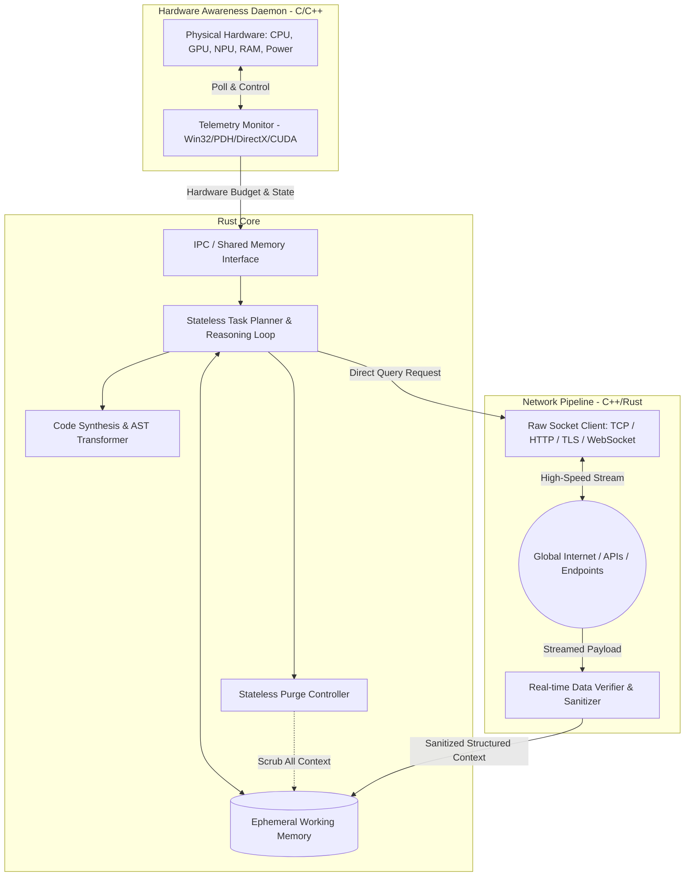
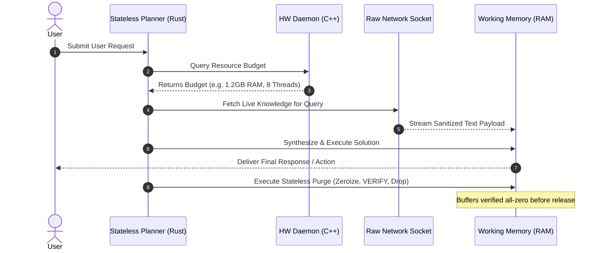

# System Architecture Specification

## 1. Architectural Philosophy

Traditional Deep Learning models conflate **cognitive processing** with **factual memorization**. A 70-billion-parameter model allocates 90%+ of its parameter weights to storing trivia, historical dates, and encyclopedic facts. This leads to massive binary footprints (50GB - 140GB+), high memory overhead, rapid factual obsolescence, and continuous hallucination risks.

**Personal Agentic AI (PAI)** decouples reasoning from storage:
* **The Brain (Pure Reasoning Engine)**: Contains only the algorithmic structure required for syntax comprehension, logic deduction, task decomposition, and code synthesis.
* **The Senses (Direct Data Ingestion Pipeline)**: Live real-time ingestion from raw networks and local storage, streamed directly into temporary RAM registers.
* **The Organism (Hardware Awareness Layer)**: Continuous introspection of physical host resources (CPU, GPU, NPU, Memory, Battery) to modulate reasoning depth and prevent system resource exhaustion.



---

## 2. Component Specifications

### 2.1 The Stateless Logic Core (`core/` - Rust)
* **Language**: Rust (2021 Edition).
* **Guarantees**: Memory safety without a garbage collector (GC), deterministic latency, data-race freedom across multi-threaded executor pools.
* **Responsibilities**:
  * **Intent Analysis**: Parses incoming user instructions into a Directed Acyclic Graph (DAG) of discrete execution steps.
  * **Ephemeral Context Management**: Allocates temporary memory buffers for the duration of a reasoning cycle. Zero persistent context is written to disk unless explicitly demanded by the user.
  * **Stateless Purge Protocol**: Once a task finishes — *or fails* — the engine zeroizes all ephemeral buffers, **verifies** the zeroing, and only then deallocates. Purge runs in a `finally`/RAII scope so no error path can skip it.

### 2.2 Hardware Self-Awareness Daemon (`hardware/` - C / C++)
* **Language**: C++20 / Modern C.
* **OS Target**: Windows (with Win32 API, Performance Data Helper `pdh.dll`, Windows Management Instrumentation `WMI`, DirectX/DXGI, NVIDIA NVML/CUDA API).
* **Telemetry Metrics Monitored**:
  * Total & Available Physical RAM (bytes).
  * System-wide CPU load percentage & per-core thermal headroom.
  * GPU Core utilization, VRAM allocation, and temperature.
  * NPU presence and driver capability.
  * Battery status (AC connected vs discharge rate).
* **Adaptive Control Policies**:
  * **Tier policy** (single source of truth: `PROTOTYPE_SPEC.md` §2.1): `COMPRESSED` when available RAM < 512 MB or load ≥ 90 % (emergency compression, drops non-essential buffers); `BALANCED` below 2048 MB or load ≥ 75 %; otherwise `HIGH`.
  * **NPU / GPU Present**: Automatically redirects matrix calculations and vector transformations away from the CPU onto hardware accelerators.
  * **Thermal / Battery Throttling**: Restricts speculative thread branching when running on battery or when thermal trip points are approached.

### 2.3 Direct Network Ingestion Pipeline (`hardware/` & `core/`)
* **Core Principle**: Bypassing heavyweight browser engines (Chromium, WebKit) and DOM rendering trees.
* **Protocol Support**: Raw TCP/IP, TLS 1.3, HTTP/1.1 & HTTP/2, WebSockets.
* **Pipeline Stages**:
  1. **Socket Request**: Dispatches lightweight HTTP/TLS requests directly to target endpoints or search APIs.
  2. **Streaming Parse**: Streams response bytes directly into a streaming parser (extracting raw text, Markdown, JSON, XML).
  3. **Verification & Sanitization**:
     * Strips active code scripts (`<script>`, inline JS, tracking pixels).
     * Computes quality scores based on source trust heuristics and content density.
     * Enforces size thresholds to prevent buffer overflows or denial-of-service payloads.

---

## 3. Inter-Process Communication (IPC) Architecture

The multi-tier system communicates across low-latency IPC boundaries:

```
[ Hardware Daemon (C++) ] <---- Named Pipe / Shared Memory ----> [ Stateless Core (Rust) ]
                                                                           ^
                                                                           | FFI / Subprocess
                                                                           v
                                                               [ Research Modules (Python) ]
```

1. **Rust $\leftrightarrow$ C++ Boundary**:
   * Uses **Windows Named Pipes** (`\\.\pipe\pai_telemetry`) or **Shared Memory (`CreateFileMappingW`)** for zero-copy streaming of hardware telemetry metrics at 100Hz.
   * Direct Foreign Function Interface (FFI) bindings via `cxx` or `bindgen` for embedded C++ routines. (Whether the *network* layer stays in C++ is decided by the Phase 2 spike — see `ROADMAP.md`.)
2. **Rust $\leftrightarrow$ Python Boundary**:
   * For rapid prototyping and research, Python modules interface via `PyO3` or standardized JSON-RPC over Standard I/O (stdio).

---

### 3.1 Telemetry IPC schema v1 (frozen at Phase 1 exit)

The C++ daemon publishes this JSON object (Named Pipe, one message per sample); the Python prototype emits the identical shape via `HardwareTelemetry.to_ipc_dict()` / `main.py --telemetry --json`.

```jsonc
{
  "schema_version": 1,
  "timestamp": 1791222978.77,          // seconds since epoch (float)
  "source": "win32-kernel32",          // win32-kernel32 | linux-procfs | psutil | unavailable
  "platform": "win32",
  "cpu_cores": 8,
  "cpu_load_pct": 23.5,                // null if unavailable
  "total_ram_gb": 15.9,                // null if unavailable (never invented)
  "avail_ram_gb": 6.2,
  "avail_ram_mb": 6348.8,
  "memory_load_pct": 61,
  "battery": { "percent": 80, "on_ac": true },   // null on desktops
  "budget": {
    "compute_tier": "HIGH",            // HIGH | BALANCED | COMPRESSED
    "max_context_bytes": 67108864,
    "allow_speculation": true,
    "thread_pool_limit": 8,
    "throttle_warning": "Normal operation. High performance tier enabled.",
    "reasons": []                      // e.g. ["memory-pressure","low-battery","cpu-saturated"]
  }
}
```

Rules: unknown values are `null`, never guessed; consumers must treat `source == "unavailable"` as BALANCED; any breaking change increments `schema_version`.

---

## 4. The Stateless Working Memory Lifecycle



---

## 5. Prototype vs Production Guarantees

| Property | Python prototype (Phase 1) | Production target |
|----------|----------------------------|-------------------|
| Buffers zeroed after task | Yes for `SecureBuffer` (memset + verified); **not** for `str` copies | All working memory (Rust `zeroize`, RAII) |
| Purge on error paths | Yes (`finally`) | Yes (Drop guards) |
| Pagefile / crash-dump exposure | Not handled | `VirtualLock`, dump control (Phase 2/3) |
| Outbound URL policy | `net_guard` (urllib: DNS re-resolved; raw: IP pinned); same table in Rust (`url_policy.rs`, conformance-tested) | Native client with IP pinning (VS3) |
| Reasoner | Stub (`TemplateReasoner`) or a local open-weights model through `LocalLLMReasoner`; symbolic engine is experimental | Router over verified models behind the same trait (ADR-008) |
| Telemetry | Polled in-process | 100 Hz push from daemon |

## 6. Privacy Note

Fetching knowledge from Wikipedia/DuckDuckGo reveals the user's topics to those services. Controls (ADR-002, implemented): domain allow-list, a visible outbound-request log showing the exact URLs sent, offline mode, and local-first knowledge from the user's own files. The product goal is therefore *local inference with minimal, visible, user-controlled outbound traffic*.

## 7. Cross-Cutting Safety Components

| Concern | Component | ADR |
|---------|-----------|-----|
| Untrusted data → instructions | `DataVerifier` screening + fenced context + `ToolBroker` taint rules | 006 |
| Self-update trust | External Ed25519 signing, separate updater, pinned Constitution hash | 005 |
| Code-execution isolation | Windows Sandbox checklist as code, hostile-output reader | 003 |
| Cross-language correctness | Golden conformance vectors | 004 |

## 8. Layering of the local assistant (ADR-008, planned)

```
 User ──► Singlish front-end / CLI / local web page      (L1, own code)
              │
              ▼
        Planner + tool broker + verify loop                (L1, own code: AST guard → restricted runner → repair)
              │                    ▲
              ▼                    │ test results, evidence
        Reasoner interface ──► open-weights models         (L2, replaceable, model cards + licences)
              │
              ▼
        Stateless purge ──► output only to the user-chosen folder

 Own-model research (L3): self-play data → fine-tune → promotion gate (ADR-008) → signed release (ADR-005)
```

Principles: the model is replaceable; numbers come from tested code; every input channel (files, documents, web, data sets, local web page) has a threat-register entry and tests; training never touches private data without explicit opt-in; no automatic weight update bypasses the promotion gate. Details: [LOCAL_ASSISTANT_SPEC.md](LOCAL_ASSISTANT_SPEC.md).
