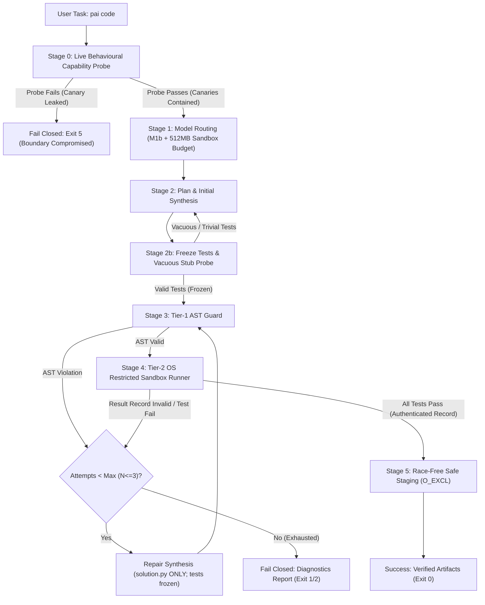

# Milestone M2: Verify Loop with Restricted Runner Specification (v2.1)

**Version:** 2.1 · **Date:** 2026-10-08 · **Status:** Proposed Specification (Conditional Sign-off for M2a; v2.1 Amendments) · **Milestone:** M2

---

## 1. Executive Summary & Phased Implementation

Milestone M2 implements the automated coding workflow for Personal Agentic AI:
```bash
pai code "<task>" --out <dir> [options]
```
To ensure security, containment, and verified execution, Milestone M2 is split into two sequential phases:
- **Phase M2a (Sandbox Runner & Boundary Spike)**:
  - Behavioural capability probe with fail-closed guarantee (Exit 5).
  - Windows runner (`research/sandbox_win32.py`): AppContainer with temporary interpreter grant + Job Object.
  - Linux runner (`research/sandbox_linux.py`): Bubblewrap (`bwrap`) + Landlock fallback + POSIX limits.
  - Full A1–A11 adversarial containment matrix passing on Windows and Linux (WSL2 Ubuntu).
  - Concurrent second-machine empirical calibration evidence for M1c.
- **Phase M2b (Verify Loop & CLI Command)**:
  - Result integrity channel (nonce-authenticated, executed test count validation).
  - Test freezing, vacuous stub probe, false-accept rate measurement.
  - Tier-1 AST Guard with relaxed memory streams and $\ge 50$ task evaluation.
  - Bounded repair state machine ($N \le 3$), race-free staging (`O_CREAT | O_EXCL`), and `pai code` CLI.

---

## 2. Command-Line Interface Contract

### 2.1 Invocation Syntax
```bash
pai code "<task_description>" --out <output_directory> [options]
```

### 2.2 Arguments & Options
| Argument / Flag | Type | Default | Hard Limit | Description |
|---|---|---|---|---|
| `<task_description>` | Positional String | *Required* | — | Natural language task specification. |
| `--out <dir>` | Path | *Required* | — | Output directory. Symlinks strictly rejected. |
| `--tests <file>` | Path | `None` | — | User-supplied golden unit tests. Immutable; overrides model test generation. |
| `--model <name>` | String | `None` (auto) | — | Explicit candidate override from user allow-list. |
| `--max-repairs <N>` | Integer | `3` | $1 \le N \le 5$ | Maximum repair iterations before terminating. |
| `--timeout <sec>` | Float | `10.0` | $\le 30.0\text{ s}$ | Hard wall-clock timeout per test execution run. |
| `--memory-mb <MB>` | Float | `512.0` | $\le 2048.0\text{ MB}$ | Memory limit per sandbox process. |
| `--overwrite` | Flag | `False` | — | Explicitly permits replacing existing files in `--out <dir>`. |
| `--sandbox <mode>` | Enum | `auto` | `auto`, `winsandbox` | Default `auto` (AppContainer/bwrap). `winsandbox` requests Windows Sandbox VM (ADR-003). |
| `--json` | Flag | `False` | — | Emits structured JSON diagnostics for CI and programmatic callers. |

### 2.3 Exit Codes
- `0`: **Success**. Code passed model-generated (or user-supplied) tests and was safely staged to `--out`.
- `1`: **Syntax / AST Rejection**. Code failed static AST rules and was not repaired within max attempts.
- `2`: **Test Failure / Runtime Exception**. Code failed tests or threw exceptions and was not repaired within max attempts.
- `3`: **Explicit Boundary Violation Trapped**. Code attempted an explicitly trapped AST violation or sandbox boundary tripwire.
- `4`: **Filesystem Safety Error**. File collision in `--out` without `--overwrite`, or symlink detected.
- `5`: **Boundary Unavailable / Resource Refusal**. Behavioural capability probe failed (fail-closed), or insufficient host RAM.

---

## 3. End-to-End Pipeline Architecture



### 3.1 Stage 0: Live Behavioural Capability Probe (Fail-Closed)
Before prompting the model or accepting untrusted input, PAI executes a **live behavioural canary probe** inside a candidate sandbox:
1. **Network Probe**:
   - Parent binds an ephemeral loopback TCP listener on `127.0.0.1`.
   - Child inside the candidate sandbox attempts `socket.connect((parent_ip, parent_port))`.
   - **Must fail** (`WSAEACCES`, `ECONNREFUSED`, `ENETUNREACH`, or `PermissionError`).
2. **Filesystem Read/Delete Probe**:
   - Parent creates a temporary canary file outside the scratch directory (`canary_<uuid>.tmp`).
   - Child attempts `open(canary, "r")` and `os.remove(canary)`.
   - **Must fail** (`PermissionError` / `FileNotFoundError`).
3. **Filesystem Write Probe**:
   - Child attempts `open(outside_canary, "w")`.
   - **Must fail** (`PermissionError`).
4. **Process Proliferation Probe**:
   - Child attempts to spawn a child process or fork.
   - **Must fail** (`Access is denied` or `BlockingIOError`).
5. **Fail-Closed Gate**:
   - If **any** canary check succeeds (containment failed), execution is refused immediately (**Exit Code 5**):
     ```
     Execution refused: OS sandbox capability probe failed. Boundary is not airtight.
     PAI will not execute model code without verified OS containment.
     ```
   - PAI **never** falls back to an unisolated runner.

### 3.2 Stage 1: Hardware-Aware Model Routing
1. Identifies command task class as `code`.
2. Queries live system telemetry (`HardwareTelemetry`): available RAM, CPU load, and battery state.
3. Computes required admission RAM:
   $$\text{admission\_ram\_mb} = \text{model\_required\_ram\_mb} + 512.0\text{ MB (sandbox budget)}$$
   - Uses empirical thresholds from `research/model_profiles.json`:
     - `qwen2.5-coder:7b`: requires $1817.9\text{ MB} + 512\text{ MB} = 2329.9\text{ MB}$ calibrated ($2470.9 + 512 = 2982.9\text{ MB}$ uncalibrated).
     - `qwen2.5-coder:1.5b`: requires $1102.4\text{ MB} + 512\text{ MB} = 1614.4\text{ MB}$ calibrated ($1397.6 + 512 = 1909.6\text{ MB}$ uncalibrated).
4. If available RAM is insufficient for 1.5B + sandbox budget, refuses execution gracefully with resource diagnostics.

### 3.3 Stage 2: Synthesis, Test Freezing & Vacuous Stub Probe
1. Prompts model for `solution.py` and `test_solution.py`.
2. **Handling Token Truncation**: If model generation yields `[TRUNCATED]` or incomplete code blocks, it is counted as a failed attempt, triggering re-prompting with compact instructions.
3. **Test Freezing**: Once `test_solution.py` is generated, it is **frozen**. During subsequent repair cycles, the model is prompted to modify `solution.py` exclusively. Tests cannot be weakened, edited, or deleted.
4. **Vacuous Stub Probe**:
   - The runner extracts all tested symbols from the test module via AST.
   - Builds a dummy stub defining each symbol:
     ```python
     def stub_func(*args, **kwargs):
         raise NotImplementedError("Stub probe")
     ```
   - Executes the test suite against the stub.
   - If tests pass on the stub, the test suite is flagged as **vacuous** (e.g. `assert True` or trivial assertions) and rejected, prompting re-generation.

### 3.4 Stage 3: Tier-1 Static AST Guard
Both `solution.py` and `test_solution.py` are parsed via Python `ast.parse`.

#### Rules & Deny-Lists
1. **Forbidden Module Imports**:
   - Forbidden: `ctypes`, `subprocess`, `socket`, `ssl`, `asyncio`, `http`, `urllib`, `requests`, `ftplib`, `smtplib`, `poplib`, `imaplib`, `multiprocessing`, `threading`, `_thread`, `concurrent`, `pty`, `builtins`, `importlib`, `pkgutil`, `runpy`, `code`, `codeop`, `compileall`, `winreg`, `msvcrt`, `fcntl`, `posix`, `resource`, `signal`, `shutil`, `pickle`, `marshal`.
   - Permitted: In-memory streams (`io.StringIO`, `io.BytesIO`), text/math/data helpers (`math`, `re`, `json`, `csv`, `collections`, `itertools`, `functools`, `typing`, `dataclasses`, `datetime`).
2. **Dynamic Execution Builtins**:
   Rejects calls to `eval`, `exec`, `compile`, `__import__`, `breakpoint`, `globals`, `locals`.
3. **Nuanced Attribute Access**:
   Bans `getattr` only when targeting private dunders (`__subclasses__`, `__globals__`, `__code__`, `__builtins__`). Normal attribute lookups are permitted.
4. **Nuanced Path Screening**:
   Inspects literal arguments to file functions (`open()`). Rejects paths that start with `/`, drive letters (`C:\`), UNC prefixes (`\\`), or contain directory traversal tokens (`..`). General string literals with `/` (regex, math, docstrings) are permitted.
5. **False-Positive Evaluation Gate**:
   AST guard must achieve 0% false positives across $\ge 50$ compliant coding tasks.
6. **Tier-1 Architectural Role**:
   Optimization filter only. Containment credit in the adversarial matrix is assigned strictly to Tier-2 OS primitives.

### 3.5 Stage 4: Tier-2 OS Restricted Sandbox Runner

#### A. Windows Host Boundary (AppContainer + Job Object)
1. **AppContainer Isolation**:
   - Child runs under an AppContainer profile with **zero capabilities** (`internetClient` and `privateNetworkClientServer` omitted). Sockets blocked at kernel TCP/IP driver layer.
   - Filesystem ACLs: AppContainer has zero access to user directories (`C:\Users\...`, `.ssh`, Documents, Desktop).
   - **Interpreter Access**: To support per-user Python installations (e.g. `%LOCALAPPDATA%\Programs\Python`), the runner applies a temporary read-only `ACCESS_ALLOWED_ACE` (`GENERIC_READ | GENERIC_EXECUTE`) for the ephemeral AppContainer SID to `sys.base_prefix`. This ACE is strictly removed in a `finally:` cleanup block upon child exit, leaving no permanent system ACL changes.
2. **Windows Job Objects (`JOBOBJECT_EXTENDED_LIMIT_INFORMATION` & `JOBOBJECT_BASIC_LIMIT_INFORMATION`)**:
   - `JOB_OBJECT_LIMIT_KILL_ON_JOB_CLOSE`: Unconditionally terminates all child processes on parent close/exit.
   - `JOB_OBJECT_LIMIT_PROCESS_MEMORY` & `JOB_OBJECT_LIMIT_JOB_MEMORY`: Enforces 512 MB hard cap.
   - `PerProcessUserTimeLimit`: CPU-time limit set to 10.0 seconds.
   - `JOB_OBJECT_LIMIT_ACTIVE_PROCESS`: Set to **1** by invoking the base Python binary (`sys._base_executable`) directly, bypassing venv launcher trampolines.
   - `JOB_OBJECT_LIMIT_DIE_ON_UNHANDLED_EXCEPTION`: Suppresses WER crash dialogs.

#### B. Linux Host Boundary (Bubblewrap / Landlock + POSIX Limits)
1. **Bubblewrap (`bwrap`) Execution**:
   ```bash
   bwrap --ro-bind /usr /usr \
         --ro-bind /lib /lib \
         --ro-bind /lib64 /lib64 \
         --ro-bind /etc /etc \
         --ro-bind <python_base_prefix> <python_base_prefix> \
         --proc /proc \
         --dev /dev \
         --new-session \
         --clearenv \
         --unshare-ipc \
         --cap-drop ALL \
         --unshare-net \
         --unshare-pid \
         --die-with-parent \
         --tmpfs /home \
         --tmpfs /tmp \
         --bind <scratch_dir> <scratch_dir> \
         python3 -I -B -s -S test_solution.py
   ```
   - Interpreter access: `--ro-bind <python_base_prefix> <python_base_prefix>` explicitly grants read access to pyenv/venv interpreters even when `/home` is masked with tmpfs.
   - Mount order: `<scratch_dir>` is bound after `/tmp` tmpfs so it is never shadowed.
   - `--new-session`: Prevents terminal keystroke injection attacks (`TIOCSTI`).
   - Symlinks for `/lib` and `/lib64` handled cleanly.
2. **Landlock LSM Fallback**:
   - Ruleset restricting path access to `<scratch_dir>` and system libraries.
   - Note: If unprivileged network namespace fails on Ubuntu 24.04, the behavioural capability probe detects network leakage and fails closed (Exit 5).
3. **POSIX Resource Limits (`setrlimit` / `prlimit`)**:
   - `RLIMIT_AS`: 512 MB.
   - `RLIMIT_CPU`: 5 seconds CPU time.
   - `RLIMIT_NPROC`: 1 (when non-root).
   - `RLIMIT_FSIZE`: 1 MB.

#### C. Process Isolation & Stream Bounding
- Executable resolved to base interpreter (`sys._base_executable`) and invoked strictly with `-I -B -s -S`.
- Ephemeral scratch directory wiped on completion.
- Scrubbed environment variables (empty `PATH`, scrubbed tokens/secrets).
- `stdout` and `stderr` streams capped at 64 KB with safe truncation, preventing pipe buffer deadlocks.

### 3.6 Stage 5: Verify Loop Result Integrity & Repair Machine
1. **Authenticated Result Channel**:
   - Model-written tests run in the same child process as `solution.py`.
   - The runner **does not trust** child exit codes or unauthenticated stdout (preventing forged outputs or `os._exit(0)` bypasses).
   - The test harness writes a structured result file to the scratch directory containing:
     - Cryptographic nonce generated by parent.
     - Number of executed test cases.
     - Test assertion outcomes.
   - Parent validates: result file exists, matches nonce, and `executed_count == frozen_test_count`. Exit without a verified result file is treated as a test failure.
2. **Bounded Repair State Machine**:
   - Maximum 3 iterations ($N = 3$).
   - Error extraction: failing assertion statement, exception name, line number in `solution.py`.
   - Repair prompt requests revised `solution.py` exclusively. Tests cannot be modified.
   - Single logged test-regeneration step allowed if tests fail the stub probe, provided assertion count does not decrease.

### 3.7 Stage 6: Race-Free Safe Staging & Non-Overwrite Contract
1. **Target Directory Validation**:
   - Resolves `--out <dir>`.
   - Rejects if `<dir>` is a symlink or contains symlinks traversing outside target root.
2. **Fixed Output File Names**:
   - Output files are strictly fixed by the tool: `<out_dir>/solution.py` and `<out_dir>/test_solution.py`.
3. **Race-Free Exclusive Creation (`O_CREAT | O_EXCL`)**:
   - If `--overwrite` is `False`:
     - Opens files using `os.open(target_file, os.O_CREAT | os.O_EXCL | os.O_WRONLY, 0o644)`.
     - If the target file already exists (or is created concurrently by another process), the kernel atomic call fails immediately with `FileExistsError`.
     - Emits message: `Refusing to overwrite existing file '<path>'. Use --overwrite to replace.` (Exit Code 4).
   - If `--overwrite` is `True`:
     - Writes to temporary file in target directory: `.<name>.tmp.<uuid>`.
     - Flushes and calls `os.fsync()`.
     - Atomically replaces target via `os.replace()`.
4. **Outcome Labeling**:
   - Result is labeled: `"Status: Verified (passes model-generated tests)"` or `"Status: Verified (passes user-supplied tests)"`.
   - Never described as "proven correct".

---

## 4. Adversarial Attack Containment Matrix by Platform

The following matrix documents containment across all 11 adversarial vectors, identifying the specific layer responsible on each supported platform:

| ID | Attack Vector | Payload Example | Windows Containment Layer | Linux Containment Layer | Expected Result | Residual Risks |
|---|---|---|---|---|---|---|
| **A1** | **Infinite Loop** | `while True: pass` | **Tier-2**: Job Object CPU time limit (`PerProcessUserTimeLimit`) + Watchdog. | **Tier-2**: `RLIMIT_CPU` (5s) + Watchdog. | Terminated cleanly at deadline. | CPU spiked for duration of timeout. |
| **A2** | **Memory Bomb** | `bytearray(10 * 1024**3)` | **Tier-2**: Job Object `PROCESS_MEMORY` (512 MB). | **Tier-2**: `RLIMIT_AS` (512 MB). | Immediate `MemoryError` in child. | Transient page allocations. |
| **A3** | **Fork Bomb** | `while True: os.fork()` | **Tier-2**: Job Object `ACTIVE_PROCESS=1` limit. | **Tier-2**: `bwrap --unshare-pid` + `RLIMIT_NPROC=1`. | Fails with `Access Denied` / `BlockingIOError`. | In root containers without bwrap, `RLIMIT_NPROC` ignored. |
| **A4** | **Canary Deletion** | `os.remove("../../canary.txt")` | **Tier-2**: AppContainer (scratch directory ACL only). | **Tier-2**: `bwrap` (root mounted read-only) / Landlock. | `PermissionError: [WinError 5] Access is denied` / `EACCES`. | Misconfigured scratch directory path. |
| **A5** | **Filesystem Read Escape** | Reading `~/.ssh` or `/etc/shadow` | **Tier-2**: AppContainer (user profile unreadable). | **Tier-2**: `bwrap` (`/home` tmpfs masked) / Landlock. | `PermissionError` / `FileNotFoundError`. | World-readable files in system root. |
| **A6** | **Network Egress** | `socket.socket().connect(...)` | **Tier-2**: AppContainer (no network capabilities). | **Tier-2**: `bwrap --unshare-net` / `CLONE_NEWNET`. | `OSError: Access denied` / Network unreachable. | Local IPC mechanisms if not restricted. |
| **A7** | **Subprocess** | `subprocess.run(["cmd.exe"])` | **Tier-2**: Job Object `ACTIVE_PROCESS=1` + Tier-1 AST. | **Tier-2**: `bwrap` scoped PATH + Tier-1 AST. | Blocked at Tier-2 / Tier-1. | Subprocess hooks in native extensions. |
| **A8** | **Ctypes Loading** | `import ctypes; ...` | **Tier-1**: AST import deny-list + **Tier-2**: AppContainer Low Rights. | **Tier-1**: AST import deny-list + **Tier-2**: `bwrap` read-only root. | Blocked at Tier-1 / Tier-2. | Dynamic imports via obfuscated byte arrays. |
| **A9** | **Stdout Flood** | `while True: print("A" * 10000)` | **Tier-2**: Runner 64 KB pipe buffer truncation. | **Tier-2**: Runner 64 KB pipe buffer truncation. | Truncated safely at 64 KB without deadlock. | Ephemeral disk write if redirected to file. |
| **A10** | **Hidden Test Tampering** | `sys._getframe().f_back...` | **Tier-2**: Separate process address space. | **Tier-2**: Separate process address space. | Solution cannot inspect or modify evaluator frame. | In-process solution tampering with model-written tests. |
| **A11** | **Segfault / Crash** | Invalid bytecode or null pointer | **Tier-2**: Job Object `DIE_ON_UNHANDLED_EXCEPTION`. | **Tier-2**: Kernel `SIGSEGV` trap. | Caught cleanly as child process failure. | Exit code normalized. |

*Claims Compliance Note*: All listed vectors must be contained; acceptance requires passing tests on both Windows and Linux, with residual risks listed above.

---

## 5. Evaluation & Verification Protocol v2

### 5.1 Benchmark Dataset Integrity
The M2 verification loop is evaluated against the frozen coding benchmark suite:
- **Tasks File**: `research/eval_sets/coding_tasks.json`
  - SHA-256: `df026a8b472c3eb2af8103c21e6f3b53db7baddca54df8b85826e7b274c9a56e`
  - Number of tasks: 20
- **Hidden Tests File**: `research/eval_sets/hidden_tests/test_coding_tasks.py`
  - SHA-256: `63e1e839ca4715e7bee944f1e3e3f528a3bef4a38c0d654a147599474369f1b1`
- Hashes verified against `docs/evidence/eval_sets_hashes.json`.

### 5.2 Strict Test Set Separation (Non-Contamination)
1. **Verify Loop Execution**:
   - The verify loop runs strictly with **model-generated tests** (or `--tests` if user-supplied).
   - Hidden tests from `test_coding_tasks.py` are **never** executed, imported, or revealed during the generation or repair stages.
2. **Offline Evaluation Phase**:
   - Once `pai code` completes and writes `solution.py`, the offline evaluator executes the frozen hidden tests against `solution.py` in a separate, isolated evaluation process.

### 5.3 Metric Definitions & False-Accept Quality
- **`pass@1_zero_shot`**: Proportion of tasks passing hidden tests on the very first generation (no repair).
- **`pass@1_repair3`**: Proportion of tasks passing hidden tests after the complete verify-and-repair loop ($\le 3$ repair attempts).
- **`false_accept_rate`**: Proportion of tasks that passed model-generated tests but failed hidden evaluation tests:
  $$\text{False-Accept Rate} = \frac{\text{Passed model tests but FAILED hidden tests}}{\text{Total passing model tests}}$$
- **Noise Margin & Reporting Protocol**:
  - Sample size is $N = 20$ tasks; binomial variance is approximately $\pm 10–15\%$ (2–3 tasks). Claims of "statistical significance" are strictly prohibited.
  - Evaluation requires **5 repeated runs** with recorded random seeds.
  - Results must report: median pass rate, min-max range, and per-task flip table.

---

## 6. Milestone M2 Exit Criteria

Milestone M2 is partitioned into two gates:

### Gate M2a: Sandbox Boundary Acceptance
1. Behavioural capability probe executes and refuses execution fail-closed (Exit 5) if canaries fail.
2. All 11 adversarial containment tests (A1–A11) pass on Windows (AppContainer + Job Object) and Linux (WSL2 Ubuntu + bwrap).
3. Canary files outside scratch remain unread, unwritten, and undeleted.
4. Second-machine empirical calibration evidence produced concurrently on WSL2 Ubuntu for M1c.

### Gate M2b: Verify Loop & Tool Acceptance
1. `pai code "<task>" --out <dir>` executes end-to-end, writing artifacts only upon test passage.
2. AST Guard demonstrates 0% false positives across $\ge 50$ compliant tasks (including file, CSV, string tasks).
3. Vacuous stub probe correctly rejects trivial/empty test suites.
4. Result integrity channel verifies test count and blocks forged/abrupt exits.
5. Safe staging race-freedom verified: concurrent write and pre-existing file collisions rejected via `O_CREAT | O_EXCL` without data overwrite. Symlinks rejected.
6. Evaluation protocol completed on `research/eval_sets/coding_tasks.json` across 5 repeat runs, reporting `pass@1_zero_shot`, `pass@1_repair3`, and `false_accept_rate`.
7. Claims lint (`test_claims.py`) passes cleanly with no banned claims.
8. Ctypes allow-list test (`test_ctypes_allowlist.py`) passes with `# SAFETY:` comments enforced.
