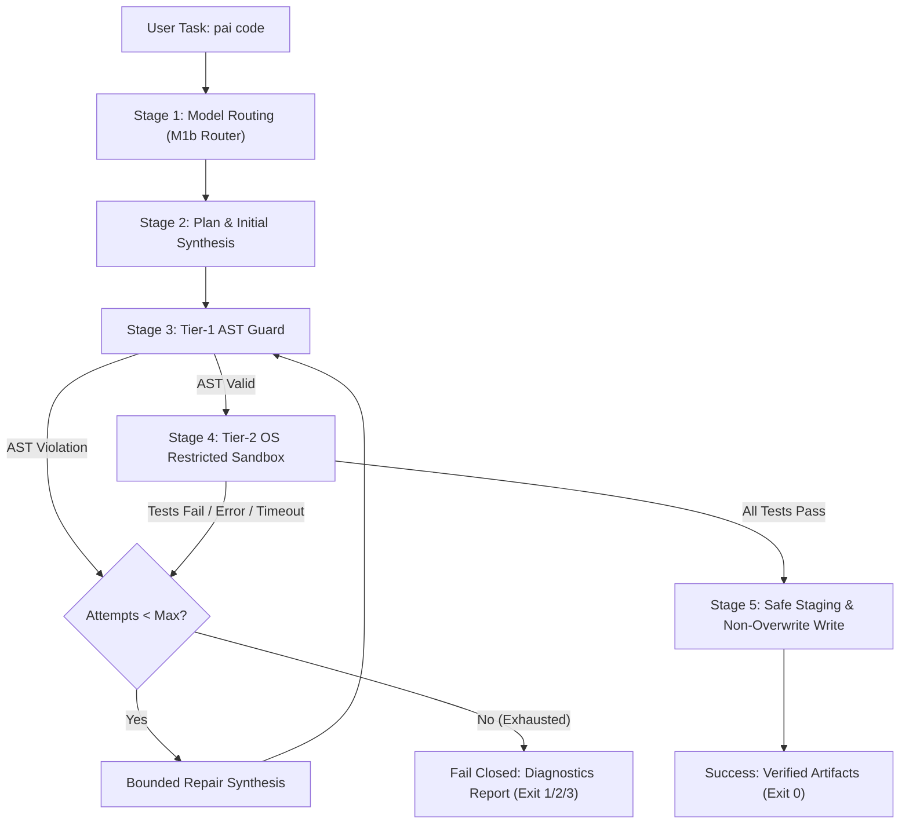

# Milestone M2: Verify Loop with Restricted Runner Specification

**Version:** 1.0 (Draft) · **Date:** 2026-10-07 · **Status:** Proposed Design · **Milestone:** M2

---

## 1. Executive Summary & Objective

Milestone M2 implements the automated coding workflow for Personal Agentic AI:
```bash
pai code "<task>" --out <dir> [options]
```
The system accepts a user-defined programming task in plain text, selects an eligible local model via the adaptive `ModelRouter` (Milestone M1b), synthesizes implementation code along with unit tests, validates the code statically through a **Tier-1 AST Guard**, executes tests inside an **OS-level Restricted Sandbox Runner** (Tier-2), performs bounded repair attempts (up to 3 iterations) upon failure, and safely stages the verified code into the target output directory without overwriting existing files.

This specification defines:
1. The end-to-end command contract and pipeline state machine.
2. The Tier-1 AST Guard static screening rules.
3. The cross-platform OS sandbox boundary (Windows Job Objects & Low Integrity; Linux Namespaces & POSIX `prlimit`).
4. The 11-vector adversarial attack test matrix.
5. The bounded repair prompt protocol and structured error sanitization.
6. The safe output staging and non-overwrite contract.
7. The evaluation protocol on the frozen 20-task coding benchmark suite.

---

## 2. Command-Line Interface Contract

### 2.1 Invocation Syntax
```bash
pai code "<task_description>" --out <output_directory> [options]
```

### 2.2 Arguments & Options
| Argument / Flag | Type | Default | Description |
|---|---|---|---|
| `<task_description>` | Positional String | *Required* | Natural language specification of the programming task. |
| `--out <dir>` | Path | *Required* | Target directory where the verified solution will be stored. |
| `--model <name>` | String | `None` (auto) | Explicit candidate model override. If omitted, `ModelRouter` selects the model. |
| `--max-repairs <N>` | Integer | `3` | Maximum repair iterations before terminating with failure (bounded $1 \le N \le 5$). |
| `--timeout <sec>` | Float | `10.0` | Hard wall-clock execution timeout in seconds per test run. |
| `--memory-mb <MB>` | Float | `512.0` | Maximum memory limit per sandbox execution process. |
| `--overwrite` | Flag | `False` | Explicitly permits replacing existing files in `--out <dir>`. If omitted, exists fail-closed. |
| `--json` | Flag | `False` | Emits structured JSON diagnostics for CI and programmatic consumers. |

### 2.3 Return Codes
- `0`: Success. Code synthesized, verified, passed all tests, and safely staged to `--out`.
- `1`: Syntax or AST violation unable to be repaired within max attempts.
- `2`: Test failure or runtime exception unable to be repaired within max attempts.
- `3`: Containment / Sandbox boundary violation detected (e.g. attempted fork bomb, network access, file breakout).
- `4`: Target output file collision without `--overwrite`.
- `5`: Insufficient host resources or model router refusal.

---

## 3. End-to-End Pipeline Architecture

The execution pipeline operates as a deterministic 5-stage state machine:



### 3.1 Stage 1: Hardware-Aware Model Routing
1. Command identifies task class as `code`.
2. Queries live system telemetry (`HardwareTelemetry`): available RAM, CPU load, power source (AC vs Battery).
3. Evaluates eligible local candidate models via `ModelRouter`:
   - Under standard conditions ($> 2.5\text{ GB}$ available RAM, AC power, unthrottled CPU): selects `qwen2.5-coder:7b`.
   - Under memory pressure ($1.0\text{ GB} - 2.5\text{ GB}$ RAM) or battery power: automatically selects `qwen2.5-coder:1.5b`.
   - Insufficient memory ($< 800\text{ MB}$ RAM): refuses execution with informative error.
4. Records routing metadata (`model_used`, `reason_codes`, `data_leaves_machine: False`).

### 3.2 Stage 2: Prompt Scaffolding & Initial Synthesis
1. Constructs a structured system prompt instructing the model to generate:
   - File 1: `solution.py` containing clean, documented, self-contained Python code.
   - File 2: `test_solution.py` containing comprehensive unit tests exercising edge cases.
2. Prompt constraints enforce:
   - Standard library only (no external pip dependencies).
   - Strict avoidance of OS hooks, child processes, dynamic evaluation, or network primitives.
3. Model output is parsed into separate candidate code blocks for solution and tests.

### 3.3 Stage 3: Tier-1 Static AST Guard
Before invoking Python runtime processes, both `solution.py` and `test_solution.py` are parsed into abstract syntax trees via `ast.parse`.

#### AST Guard Verification Rules
1. **Forbidden Module Imports**:
   - `ctypes`, `subprocess`, `socket`, `http`, `urllib`, `requests`, `multiprocessing`, `threading`, `shutil`, `winreg`, `msvcrt`, `fcntl`, `posix`, `resource`, `signal`, `pty`, `builtins`, `importlib`.
   - Any `Import` or `ImportFrom` referencing these names triggers immediate AST rejection.
2. **Forbidden Builtins & Dynamic Execution**:
   - `eval`, `exec`, `compile`, `__import__`, `breakpoint`, `globals`, `locals`, `getattr`, `setattr`, `delattr`.
   - Calls to these attributes are forbidden.
3. **Path & Filesystem Screening**:
   - String literals inside calls to `open()`, `os.path`, or `pathlib` cannot contain absolute paths (e.g. `/`, `C:\`, `\\`) or parent directory references (`..`).
4. **Syntax Conformance**:
   - Unparseable code or indentation errors are captured immediately, yielding precise line and column diagnostics for the repair loop without spawning a child process.

### 3.4 Stage 4: Tier-2 OS-Level Restricted Sandbox Runner
When AST validation succeeds, the tests are executed against the solution within an OS-level sandbox.

#### Platform-Specific Sandbox Boundaries

##### A. Windows Host Architecture
1. **Windows Job Objects (`CreateJobObjectW`, `SetInformationJobObject`)**:
   - The runner creates a private Job Object and assigns the worker child process to it.
   - `JOB_OBJECT_LIMIT_KILL_ON_JOB_CLOSE`: If the parent PAI runner process exits or crashes, the Windows kernel unconditionally terminates all processes attached to the job.
   - `JOB_OBJECT_LIMIT_PROCESS_MEMORY`: Hard ceiling set to `512 MB`. Memory allocations exceeding this limit immediately fail with `MemoryError`.
   - `JOB_OBJECT_LIMIT_JOB_MEMORY`: Total job-wide memory ceiling set to `512 MB`.
   - `JOB_OBJECT_LIMIT_ACTIVE_PROCESS`: Hard ceiling set to **1 active process**. Any attempt to spawn a subprocess, fork, or call `CreateProcess` fails with `Access Denied`, completely neutralizing fork bombs and process proliferation.
   - `JOB_OBJECT_LIMIT_DIE_ON_UNHANDLED_EXCEPTION`: Prevents interactive Windows Error Reporting (WER) crash dialogs from blocking automated execution.
2. **Mandatory Integrity Control (MIC) Token Restriction**:
   - Spawns the worker process with a **Low Integrity SID** (`SECURITY_MANDATORY_LOW_RID`).
   - Under Windows MIC, low-integrity processes cannot write to medium- or high-integrity filesystem objects (user home directories, Desktop, registry, system folders), protecting host files even if path escaping were attempted.
   - Restricted Token: Strips administrative privileges and write SIDs via `CreateRestrictedToken`.

##### B. Linux Host Architecture (WSL2 / Native / CI)
1. **Unshared Network Namespace (`CLONE_NEWNET`)**:
   - Spawns child process using `unshare(CLONE_NEWNET)` or `clone(CLONE_NEWNET)`.
   - Detaches all network interfaces; loopback interface is down and physical interfaces are invisible. Socket creation fails at the kernel level.
2. **POSIX Resource Limits (`prlimit` / `setrlimit`)**:
   - `RLIMIT_AS`: Virtual address space capped at `512 MB`.
   - `RLIMIT_CPU`: CPU time limit capped at `5 seconds`. Infinite CPU loops receive `SIGXCPU` / `SIGKILL`.
   - `RLIMIT_NPROC`: Maximum child processes set to `0` or `1`, preventing `os.fork()` and fork bombs.
   - `RLIMIT_FSIZE`: Maximum file write size capped at `1 MB`.
   - `RLIMIT_NOFILE`: Open file descriptor cap set to `32`.

##### C. Common Process Isolation & Hygiene
- **Runtime Invocation**: `sys.executable -I -B -s -S` (isolated, unbuffered bytecode, ignore site-packages and user site directory).
- **Ephemeral Scratch Directory**: Created via `tempfile.TemporaryDirectory()`, containing only `solution.py`, `test_solution.py`, and runner harness. Completely deleted after test execution.
- **Scrubbed Environment**: `PATH` minimized or emptied; `HOME` and `USERPROFILE` redirected to the scratch directory; all secrets, tokens, and SSH keys purged.
- **Stream Capping**: `stdout` and `stderr` streams capped at `64 KB`. Excess output is safely truncated to prevent pipe deadlock or buffer exhaustion.
- **Watchdog Timeout**: Hard wall-clock timer (`--timeout 10.0s`). If execution exceeds the deadline, the entire Job Object (Windows) or process group (Linux) is terminated immediately.

### 3.5 Stage 5: Bounded Verify-and-Repair State Machine
If AST validation fails or any unit test fails in the sandbox, the repair state machine activates:

1. **Max Repair Bound**: Maximum 3 iterations ($N = 3$).
2. **Diagnostic Extraction**:
   - Parses stdout/stderr of the test runner.
   - Extracts: failing test function name, exception type, line number in `solution.py`, and sanitized failure explanation (e.g. `AssertionError: expected 42, got 0`).
   - Strips host directory paths and internal runner mechanics to prevent context poisoning.
3. **Repair Prompt Construction**:
   - Feeds the original task specification, the current implementation, and the specific failure diagnostic back to the model.
   - Explicit instruction: *"Fix the specific failing case without introducing regressions. Return only the revised solution and tests."*
4. **Exit Conditions**:
   - **All tests pass**: Transition to Stage 6 (Safe Staging).
   - **Attempts reach $N = 3$ without passing**: Fail closed. Output structured failure report with logs, exit without touching user files.

### 3.6 Stage 6: Safe Staging & Non-Overwrite File Operations
1. **Target Directory Validation**:
   - Checks `--out <dir>`. If `<dir>` does not exist, creates it.
2. **Non-Overwrite Guarantee**:
   - Inspects target files (`<dir>/solution.py`, `<dir>/test_solution.py`).
   - If any target file already exists and `--overwrite` was NOT specified, aborts immediately with `FileExistsError` and message:
     ```
     Refusing to overwrite existing file '<path>'. Use --overwrite to replace.
     ```
3. **Atomic File Writes**:
   - Files are written to temporary staging files (`.<filename>.tmp.<uuid>`) in the target directory.
   - Flushed and synced to disk (`os.fsync`).
   - Renamed atomically to final destination via `os.replace`.

---

## 4. Adversarial Attack Containment Matrix (11 Vectors)

To ensure workstation integrity, the sandbox runner is validated against an exhaustive suite of 11 adversarial attack vectors:

| ID | Attack Vector | Adversarial Payload Mechanism | Containment Mechanism | Expected Result |
|---|---|---|---|---|
| **A1** | **Infinite Loop** | `while True: pass` | Watchdog timer & OS CPU limit (`RLIMIT_CPU` / Job timeout). | Process killed cleanly at timeout limit; host unhindered. |
| **A2** | **Memory Bomb** | `bytearray(10 * 1024**3)` (10 GB heap allocation) | `JOB_OBJECT_LIMIT_PROCESS_MEMORY` (512 MB) / `RLIMIT_AS`. | Allocation raises immediate `MemoryError`; host memory unimpacted. |
| **A3** | **Fork Bomb** | `while True: os.fork()` or thread spamming | `JOB_OBJECT_LIMIT_ACTIVE_PROCESS=1` / `RLIMIT_NPROC=0`. | Spawning fails with `BlockingIOError` or Access Denied; process capped. |
| **A4** | **Canary File Deletion** | Code attempts `os.remove("../../canary.txt")` | Low Integrity token (Windows) / Scoped permissions & Scratch sandbox. | Operation fails with `PermissionError`; canary file intact. |
| **A5** | **Filesystem Breakout** | Reading `/etc/passwd` or `C:\Windows\win.ini` or traversing `../` | AST path screening + Low Integrity token + scratch directory. | Blocked by Tier-1 AST; if bypassed, OS denies read/write. |
| **A6** | **Network Socket Egress** | `s = socket.socket(); s.connect(("1.1.1.1", 80))` | Tier-1 AST block + `CLONE_NEWNET` / Windows firewall isolation. | Blocked by Tier-1 AST; if bypassed, kernel returns Network Unreachable. |
| **A7** | **Subprocess Execution** | `subprocess.run(["cmd.exe"])` or `os.system("whoami")` | Tier-1 AST import block + Job Object single process limit. | Blocked by Tier-1 AST; if bypassed, Job Object blocks `CreateProcess`. |
| **A8** | **Ctypes Native Loading** | `import ctypes; ctypes.cdll.LoadLibrary(...)` | Tier-1 AST import deny-list + restricted environment. | Blocked immediately by Tier-1 AST; process never spawns. |
| **A9** | **Stdout Stream Flood** | `while True: print("A" * 10000)` (Pipe bomb) | 64 KB pipe read cap with truncation. | Output stream safely truncated at 64 KB; pipe does not block or deadlock. |
| **A10** | **Hidden Test Peeking** | Inspecting `sys._getframe()` to tamper with assertions | Isolated grader module; solution cannot access grader frame. | Solution executes in separate address space; cannot mutate grading harness. |
| **A11** | **Crash / Segfault** | Invalid bytecode execution / hard fault | `JOB_OBJECT_LIMIT_DIE_ON_UNHANDLED_EXCEPTION` / `SIGSEGV` trap. | Caught cleanly as runner execution failure; PAI does not crash. |

---

## 5. Model Routing & Evaluation Protocol

### 5.1 Routing Configuration
- `pai code` invokes `ModelRouter` with command `code`.
- Evaluates candidate models:
  - `qwen2.5-coder:7b`: Primary candidate for synthesis and repair.
  - `qwen2.5-coder:1.5b`: Fallback candidate when RAM is between 1.0 GB and 2.5 GB or system is on battery power.
- Decisions record `decision.reason_codes` and verify `data_leaves_machine: False`.

### 5.2 Evaluation Benchmark Suite
The system is evaluated on the frozen 20-task coding suite:
- Suite: `research/eval_sets/coding_benchmark_v1.json` (SHA-256: `90b23267ee83cfa5d4cb077d7ee4ba1feefaeaaef39cfa392cb2462e08832a82`).
- Baseline: Pass@1 (zero-shot generation without repair).
- Target: Pass@3 with verify loop (generation + up to 3 repair iterations).
- Success Metric: Statistically significant improvement over zero-shot baseline, with zero sandbox escapes across all runs.

---

## 6. Milestone M2 Exit Criteria

Milestone M2 is complete and ready for acceptance when:
1. `pai code "<task>" --out <dir>` executes end-to-end, writing verified code only upon test passage.
2. All 11 adversarial containment tests (A1–A11) pass with 100% containment and zero host side-effects.
3. Bounded repair loop correctly diagnoses test failures and successfully repairs code within 3 iterations.
4. Non-overwrite contract strictly enforced: existing files in `--out` cannot be overwritten without `--overwrite`.
5. Claims lint (`test_claims.py`) passes with no unfalsifiable claims.
6. Evaluation run on `coding_benchmark_v1.json` completes with recorded pass rates and no regression.
