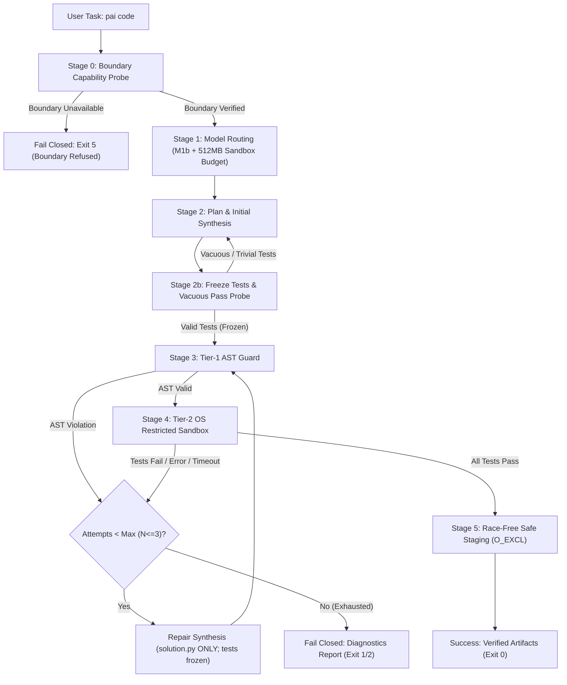

# Milestone M2: Verify Loop with Restricted Runner Specification (v2.0)

**Version:** 2.0 · **Date:** 2026-10-08 · **Status:** Proposed Design (Revised per Reviewer Findings) · **Milestone:** M2

---

## 1. Executive Summary & Objective

Milestone M2 implements the automated coding workflow for Personal Agentic AI:
```bash
pai code "<task>" --out <dir> [options]
```
The command accepts a programming task in natural language, selects an eligible local model via the adaptive `ModelRouter` (incorporating a 512 MB sandbox admission budget), synthesizes solution code and initial unit tests, validates code through a **Tier-1 Static AST Guard**, executes the tests inside an **OS-level Restricted Sandbox Runner** (Tier-2), performs bounded repair attempts (up to 3 iterations) using model-test feedback while keeping tests frozen, and atomically stages verified code into `--out <dir>` without race conditions or overwrites.

### Key Architectural Principles (v2.0 Revision)
1. **True OS Boundary**: Windows uses **AppContainer + Job Objects** (default across all Windows editions, including Home); Linux uses **Bubblewrap / Landlock + Namespaces + POSIX Limits**.
2. **Fail-Closed Boundary Probe**: The runner verifies OS boundary creation at startup. If the sandbox boundary cannot be established, execution is refused immediately (**Exit Code 5**). PAI **never** silently falls back to an unisolated runner.
3. **No Self-Grading Degradation**: Model-generated tests are **frozen** after initial synthesis; the repair loop modifies `solution.py` only. Tests are probed against dummy stubs to reject vacuous passes.
4. **No Test-Set Leakage**: Hidden evaluation benchmark tests are executed strictly during final offline grading and are **never** revealed to the repair loop prompt.
5. **Race-Free Atomic Staging**: New files are created using exclusive filesystem creation (`O_CREAT | O_EXCL`) to eliminate TOCTOU overwrites. Fixed file names are enforced by the tool. Symlinks in `--out` are rejected fail-closed.

---

## 2. Command-Line Interface Contract

### 2.1 Invocation Syntax
```bash
pai code "<task_description>" --out <output_directory> [options]
```

### 2.2 Arguments & Options
| Argument / Flag | Type | Default | Hard Limit | Description |
|---|---|---|---|---|
| `<task_description>` | Positional String | *Required* | — | Natural language specification of the task. |
| `--out <dir>` | Path | *Required* | — | Target directory for verified artifacts. Symlinks rejected. |
| `--tests <file>` | Path | `None` | — | User-supplied golden unit tests. Immutable; overrides model test generation. |
| `--model <name>` | String | `None` (auto) | — | Explicit candidate override from user allow-list. |
| `--max-repairs <N>` | Integer | `3` | $1 \le N \le 5$ | Maximum repair iterations before terminating. |
| `--timeout <sec>` | Float | `10.0` | $\le 30.0\text{ s}$ | Hard wall-clock timeout per test execution run. |
| `--memory-mb <MB>` | Float | `512.0` | $\le 2048.0\text{ MB}$ | Memory limit per sandbox process. |
| `--overwrite` | Flag | `False` | — | Explicitly permits replacing existing files in `--out <dir>`. |
| `--sandbox <mode>` | Enum | `auto` | `auto`, `hyperv` | Default `auto` (AppContainer on Windows; bwrap/Landlock on Linux). `hyperv` requests Windows Sandbox VM (ADR-003). |
| `--json` | Flag | `False` | — | Emits structured JSON diagnostics for CI and programmatic callers. |

### 2.3 Exit Codes
- `0`: **Success**. Code passed model-generated (or user-supplied) tests and was safely staged to `--out`.
- `1`: **Syntax / AST Rejection**. Code failed static AST rules and was not repaired within max attempts.
- `2`: **Test Failure / Runtime Exception**. Code failed tests or threw exceptions and was not repaired within max attempts.
- `3`: **Explicit Boundary Violation Trapped**. Code attempted an explicitly trapped AST violation or sandbox boundary tripwire.
- `4`: **Filesystem Safety Error**. File collision in `--out` without `--overwrite`, or symlink detected.
- `5`: **Boundary Unavailable / Resource Refusal**. OS sandbox capability probe failed (fail-closed), or insufficient host RAM.

---

## 3. End-to-End Pipeline Architecture



### 3.1 Stage 0: Startup Boundary Capability Probe (Fail-Closed)
Before prompting the model or accepting untrusted input, PAI executes an internal capability probe:
- **Windows**:
  1. Verifies that Win32 Job Object creation and memory/process limit APIs are functional.
  2. Verifies that AppContainer profile creation (`CreateAppContainerProfile`) is functional.
- **Linux**:
  1. Checks for `bwrap` executable, OR tests Landlock LSM availability (`syscall(SYS_landlock_create_ruleset)`).
  2. Verifies network namespace detachment capability.
- **Fail-Closed Rule**: If the boundary cannot be created, execution is refused immediately (**Exit Code 5**). PAI prints:
  `"Execution refused: OS sandbox boundary cannot be established on this system. PAI will not execute model code without OS containment."`
  PAI **never** falls back to an unisolated runner.

### 3.2 Stage 1: Hardware-Aware Model Routing
1. Identifies command task class as `code`.
2. Queries live system telemetry (`HardwareTelemetry`): available RAM, CPU load, and battery state.
3. Computes required admission RAM:
   $$\text{admission\_ram\_mb} = \text{model\_required\_ram\_mb} + 512.0\text{ MB (sandbox budget)}$$
   - Uses empirical thresholds from `research/model_profiles.json`:
     - `qwen2.5-coder:7b`: requires $1817.9\text{ MB} + 512\text{ MB} = 2329.9\text{ MB}$ calibrated (or $2470.9 + 512 = 2982.9\text{ MB}$ uncalibrated).
     - `qwen2.5-coder:1.5b`: requires $1102.4\text{ MB} + 512\text{ MB} = 1614.4\text{ MB}$ calibrated (or $1397.6 + 512 = 1909.6\text{ MB}$ uncalibrated).
4. If available RAM is insufficient for 1.5B + sandbox budget, refuses execution gracefully with resource diagnostics.

### 3.3 Stage 2: Plan, Initial Synthesis & Test Freezing
1. Scaffolds structured system prompt requesting:
   - `solution.py`: implementation conforming to standard library only.
   - `test_solution.py`: unit tests exercising edge cases and typical cases.
   *(Note: if `--tests <file>` was provided by the user, test generation is skipped entirely and the user tests are used).*
2. **Handling Token Truncation**: If model generation hits Tier token caps and yields `[TRUNCATED]` or unclosed markdown blocks, the response is rejected as a generation failure, triggering a retry with compact prompt scaffolding.
3. **Test Freezing**: Once `test_solution.py` is generated, it is **frozen**. During subsequent repair cycles, the model is prompted to modify `solution.py` exclusively. The tests cannot be weakened, edited, or deleted by the model.
4. **Vacuous Pass Probe (Trivial Stub Check)**:
   - The runner executes `test_solution.py` against a trivial stub:
     ```python
     def stub_func(*args, **kwargs):
         raise NotImplementedError("Trivial stub probe")
     ```
   - If the tests pass against the stub, the test suite is flagged as **vacuous** (e.g. `assert True` or empty test body). The test suite is rejected, prompting the model to generate meaningful assertions.

### 3.4 Stage 3: Tier-1 Static AST Guard
Both `solution.py` and `test_solution.py` are parsed via Python `ast.parse`.

#### Rules & Deny-Lists
1. **Forbidden Module Imports (36 modules)**:
   `os`, `sys`, `pathlib`, `io`, `tempfile`, `glob`, `shutil`, `pickle`, `marshal`, `shelve`, `dbm`, `sqlite3`, `ctypes`, `subprocess`, `socket`, `ssl`, `asyncio`, `http`, `urllib`, `requests`, `ftplib`, `smtplib`, `poplib`, `imaplib`, `multiprocessing`, `threading`, `_thread`, `concurrent`, `pty`, `builtins`, `importlib`, `pkgutil`, `runpy`, `code`, `codeop`, `compileall`, `winreg`, `msvcrt`, `fcntl`, `posix`, `resource`, `signal`.
2. **Dynamic Execution Builtins**:
   Rejects calls to `eval`, `exec`, `compile`, `__import__`, `breakpoint`, `globals`, `locals`.
3. **Nuanced Attribute Access**:
   Bans `getattr` only when targeting private dunders (`__subclasses__`, `__globals__`, `__code__`, `__builtins__`). Normal `getattr(obj, 'name', default)` is permitted.
4. **Nuanced Path Screening**:
   Inspects literal arguments to file functions (`open()`). Rejects paths that:
   - Start with `/` (absolute Unix path).
   - Match drive letters (e.g. `C:\`, `D:/`).
   - Match UNC network shares (`\\`).
   - Contain directory traversal tokens (`..`).
   Does NOT ban `/` in general string literals (math fractions, docstrings, and regexes remain valid).
5. **False-Positive Baseline Verification**:
   The AST guard is validated against the compliant solutions in `research/eval_sets/coding_tasks.json` ensuring 0% false positives.
6. **Tier-1 Architectural Role**:
   Tier-1 AST Guard is an optimization filter. Containment credit in the adversarial matrix is assigned strictly to Tier-2 OS boundaries.

### 3.5 Stage 4: Tier-2 OS Restricted Sandbox Runner
When AST validation succeeds, tests are executed inside the OS-level sandbox.

#### Platform-Specific Implementation Details

##### A. Windows Host Boundary (AppContainer + Job Object)
1. **AppContainer Isolation**:
   - Spawns child process under an ephemeral AppContainer SID created via `CreateAppContainerProfile`.
   - **Zero Capabilities Granted**: Omitting `internetClient` and `privateNetworkClientServer` causes the Windows kernel network stack to block all socket creation, connect, and bind calls with `WSAEACCES`.
   - **Filesystem Access Control**: AppContainer grants zero access to user directories (`C:\Users\...`, `.ssh`, Documents, Desktop). The runner uses `SetNamedSecurityInfoW` to grant read/write permissions **strictly** to the ephemeral scratch directory.
2. **Windows Job Objects (`JOBOBJECT_EXTENDED_LIMIT_INFORMATION`)**:
   - `JOB_OBJECT_LIMIT_KILL_ON_JOB_CLOSE`: Guarantees that terminating or closing the parent PAI runner immediately kills all processes in the job tree.
   - `JOB_OBJECT_LIMIT_PROCESS_MEMORY` & `JOB_OBJECT_LIMIT_JOB_MEMORY`: Enforces 512 MB hard cap.
   - `JOB_OBJECT_LIMIT_ACTIVE_PROCESS`: Set to **2** (allowing base `python.exe` invocation without launcher deadlocks, while neutralizing fork bombs and process proliferation).
   - `JOB_OBJECT_LIMIT_DIE_ON_UNHANDLED_EXCEPTION`: Suppresses WER crash dialogs.

##### B. Linux Host Boundary (Bubblewrap / Landlock + POSIX Limits)
1. **Filesystem & Network Isolation**:
   - **Primary**: `bwrap` command:
     ```bash
     bwrap --ro-bind /usr /usr --ro-bind /lib /lib --ro-bind /lib64 /lib64 \
           --ro-bind /etc /etc --tmpfs /home --tmpfs /tmp --tmpfs /var \
           --bind <scratch_dir> <scratch_dir> \
           --unshare-net --unshare-pid --die-with-parent \
           python3 -I -B -s -S test_solution.py
     ```
   - **Fallback**: Landlock LSM ruleset restricting path access to `<scratch_dir>` and system libraries, combined with `CLONE_NEWNET` network unshare.
2. **POSIX Resource Limits (`prlimit` / `setrlimit`)**:
   - `RLIMIT_AS`: 512 MB virtual memory ceiling.
   - `RLIMIT_CPU`: 5 seconds CPU time.
   - `RLIMIT_NPROC`: Set to 1 (when running as non-root).
   - `RLIMIT_FSIZE`: 1 MB maximum file write size.
   - `RLIMIT_NOFILE`: 32 open file descriptors.

##### C. Common Process Isolation & Stream Bounding
- Executable resolved to base interpreter (`sys._base_executable`) and invoked strictly with `-I -B -s -S`.
- Ephemeral scratch directory wiped on completion.
- Scrubbed environment variables (empty `PATH`, scrubbed tokens/secrets).
- `stdout` and `stderr` streams capped at 64 KB with safe truncation, preventing pipe buffer deadlocks.

### 3.6 Stage 5: Bounded Verify-and-Repair State Machine
1. **Loop Bound**: Maximum 3 iterations ($N = 3$).
2. **Error Extraction**:
   - Extracts: failing assertion statement, exception name, line number in `solution.py`.
   - Strips host filesystem paths and internal runner traces.
3. **Repair Prompt Construction**:
   - Prompt includes: original task description, current `solution.py`, and the failure diagnostic.
   - Instructions: *"Modify `solution.py` to fix the failing test assertion. Do not introduce regressions. Return only the revised `solution.py`."*
   - Model cannot modify `test_solution.py`.
4. **Termination**:
   - If tests pass: Transitions to Stage 6.
   - If 3 attempts exhausted: Terminates with non-zero exit code (1 or 2) and outputs structured diagnostic report without touching `--out`.

### 3.7 Stage 6: Race-Free Safe Staging & Non-Overwrite Contract
1. **Target Directory Validation**:
   - Resolves `--out <dir>`.
   - Rejects if `<dir>` is a symlink or contains symlinks traversing outside target root.
2. **Fixed Output File Names**:
   - Output files are strictly fixed by the tool: `<out_dir>/solution.py` and `<out_dir>/test_solution.py`.
3. **Race-Free Exclusive Creation (`O_CREAT | O_EXCL`)**:
   - If `--overwrite` is `False`:
     - Opens files using `os.open(target_file, os.O_CREAT | os.O_EXCL | os.O_WRONLY, 0o644)`.
     - If the target file already exists (or is created concurrently by another process), the kernel atomic call fails immediately with `FileExistsError`.
     - Emits message: `Refusing to overwrite existing file '<path>'. Use --overwrite to replace.` (Exit Code 4).
   - If `--overwrite` is `True`:
     - Writes to temporary file in target directory: `.<name>.tmp.<uuid>`.
     - Flushes and calls `os.fsync()`.
     - Atomically replaces target via `os.replace()`.
4. **Outcome Labeling**:
   - Result is labeled: `"Status: Verified (passes model-generated tests)"` or `"Status: Verified (passes user-supplied tests)"`.
   - Never described as "proven correct".

---

## 4. Adversarial Attack Containment Matrix by Platform

The following matrix documents containment across all 11 adversarial vectors, identifying the specific layer responsible on each supported platform:

| ID | Attack Vector | Payload Example | Windows Containment Layer | Linux Containment Layer | Expected Result | Residual Risks |
|---|---|---|---|---|---|---|
| **A1** | **Infinite Loop** | `while True: pass` | **Tier-2**: Job Object CPU rate control + Watchdog timeout kill. | **Tier-2**: `RLIMIT_CPU` (5s) + Watchdog timeout kill. | Terminated cleanly at deadline; host unaffected. | CPU spiked for duration of timeout. |
| **A2** | **Memory Bomb** | `bytearray(10 * 1024**3)` (10 GB heap) | **Tier-2**: Job Object `PROCESS_MEMORY` limit (512 MB). | **Tier-2**: `RLIMIT_AS` (512 MB limit). | Immediate `MemoryError` inside child; host RAM unaffected. | Minor transient page allocation. |
| **A3** | **Fork Bomb** | `while True: os.fork()` or thread flood | **Tier-2**: Job Object `ACTIVE_PROCESS=2` limit. | **Tier-2**: `bwrap --unshare-pid` + `RLIMIT_NPROC=1`. | Spawning fails with `Access Denied` / `BlockingIOError`. | In root containers without bwrap, `RLIMIT_NPROC` ignored. |
| **A4** | **Canary File Deletion** | `os.remove("../../canary.txt")` | **Tier-2**: AppContainer (scratch directory ACL only). | **Tier-2**: `bwrap` (root mounted read-only) / Landlock. | `PermissionError: [WinError 5] Access is denied` / `EACCES`. | If scratch directory path misconfigured. |
| **A5** | **Filesystem Read Escape** | Reading `~/.ssh/id_rsa` or `/etc/shadow` | **Tier-2**: AppContainer (user profile unreadable). | **Tier-2**: `bwrap` (`/home` tmpfs masked) / Landlock. | `PermissionError` / `FileNotFoundError`. | World-readable files in Windows system root. |
| **A6** | **Network Socket Egress** | `socket.socket().connect(("1.1.1.1", 80))` | **Tier-2**: AppContainer (no network capabilities). | **Tier-2**: `bwrap --unshare-net` / `CLONE_NEWNET`. | `OSError: [WinError 10013] Access denied` / Network unreachable. | Local IPC mechanisms if not restricted. |
| **A7** | **Subprocess Execution** | `subprocess.run(["cmd.exe"])` | **Tier-1**: AST import deny-list + **Tier-2**: Job Object process cap. | **Tier-1**: AST import deny-list + **Tier-2**: `bwrap` scoped PATH. | Blocked at Tier-1; if bypassed, fails at Tier-2. | Subprocess hooks in C extensions. |
| **A8** | **Ctypes Native Loading** | `import ctypes; ctypes.cdll.LoadLibrary(...)` | **Tier-1**: AST import deny-list. | **Tier-1**: AST import deny-list. | Blocked at Tier-1 (AST rejection). | Dynamic imports via obfuscated byte arrays. |
| **A9** | **Stdout Stream Flood** | `while True: print("A" * 10000)` (Pipe bomb) | **Tier-2**: Runner 64 KB pipe buffer truncation. | **Tier-2**: Runner 64 KB pipe buffer truncation. | Output truncated at 64 KB; pipe does not hang. | Ephemeral disk write if redirected to scratch file. |
| **A10** | **Hidden Test Tampering** | `sys._getframe().f_back...` | **Tier-2**: Separate process address space. | **Tier-2**: Separate process address space. | Solution cannot inspect or modify evaluator frame. | Shared environment variables if not scrubbed. |
| **A11** | **Crash / Segfault** | Invalid bytecode or null pointer deref | **Tier-2**: Job Object `DIE_ON_UNHANDLED_EXCEPTION`. | **Tier-2**: Kernel `SIGSEGV` trap. | Caught cleanly as child process failure; runner does not crash. | Process exit code normalized. |

*Claims Compliance Note*: All listed vectors are contained in tests on each supported platform, with residual risks listed above.

---

## 5. Evaluation & Verification Protocol v2

### 5.1 Benchmark Dataset Integrity
The M2 verification loop is evaluated against the frozen coding benchmark suite:
- **Tasks File**: `research/eval_sets/coding_tasks.json`
  - SHA-256: `df026a8b472c3eb2af8103c21e6f3b53db7baddca54df8b85826e7b274c9a56e`
  - Number of tasks: 20
- **Hidden Tests File**: `research/eval_sets/hidden_tests/test_coding_tasks.py`
  - SHA-256: `63e1e839ca4715e7bee944f1e3e3f528a3bef4a38c0d654a147599474369f1b1`
- Hashes verified against `docs/evidence/eval_sets_hashes.json`.

### 5.2 Strict Test Set Separation (Non-Contamination)
1. **Verify Loop Execution**:
   - The verify loop runs strictly with **model-generated tests** (or `--tests` if user-supplied).
   - Hidden tests from `test_coding_tasks.py` are **never** executed, imported, or revealed during the generation or repair stages.
2. **Offline Evaluation Phase**:
   - Once `pai code` completes and writes `solution.py`, the offline evaluator executes the frozen hidden tests against `solution.py` in a separate, isolated evaluation process.

### 5.3 Metric Definitions & Noise Accounting
- **`pass@1_zero_shot`**: Proportion of tasks passing hidden tests on the very first generation (no repair).
- **`pass@1_repair3`**: Proportion of tasks passing hidden tests after the complete verify-and-repair loop ($\le 3$ repair attempts).
- **Noise Margin & Reporting Protocol**:
  - Sample size is $N = 20$ tasks; binomial variance is approximately $\pm 10–15\%$ (2–3 tasks).
  - Claims of "statistical significance" are strictly prohibited.
  - Evaluation requires **5 repeated runs** with recorded random seeds.
  - Results must report:
    1. Median pass rate.
    2. Min-Max pass range across runs.
    3. Per-task flip table documenting which tasks transitioned between pass and fail across runs.

---

## 6. Milestone M2 Exit Criteria

Milestone M2 is complete and eligible for acceptance when:
1. `pai code "<task>" --out <dir>` executes end-to-end, writing artifacts only upon test passage.
2. Capability probe verified: runner refuses execution fail-closed (Exit 5) if OS sandbox cannot be established.
3. All 11 adversarial containment tests (A1–A11) pass in CI across Windows (AppContainer + Job Object) and Linux (bwrap/Landlock + rlimits).
4. AST Guard demonstrates 0% false-positive rate on compliant solutions from `coding_tasks.json`.
5. Vacuous pass probe correctly rejects trivial/empty test suites.
6. Safe staging race-freedom verified: concurrent write and pre-existing file collisions rejected via `O_CREAT | O_EXCL` without data overwrite. Symlinks rejected.
7. Evaluation protocol completed on `research/eval_sets/coding_tasks.json` across 5 repeat runs, reporting `pass@1_zero_shot` vs `pass@1_repair3` with median, ranges, and task flip tables.
8. Claims lint (`test_claims.py`) passes cleanly with no banned claims.
