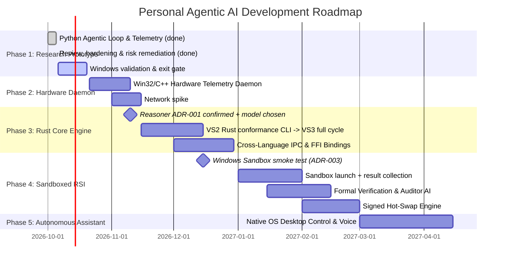

# Engineering Roadmap (Phases 1 - 5)

This roadmap outlines the systematic development of the **Personal Agentic AI (PAI)** from an agile Python research prototype to a fully autonomous, recursive self-improving native intelligence daemon.

_Last reviewed: 2026-10-05, second pass (risks R1–R7 remediated — see [PROJECT_REVIEW.md](PROJECT_REVIEW.md) §4.1 and the [ADRs](adr/README.md))._

---

## 🗺️ High-Level Phase Overview

---

## 📍 Phase 1: Python Research Prototype & Verification Lab (CURRENT — implementation complete, exit gate pending)
**Objective**: Build a working, testable prototype in Python to validate the 3-pillar concepts and the safety ideas before committing them to native compiled languages.

### Deliverables
- [x] Project scaffolding (`core/`, `hardware/`, `research/`, `docs/`).
- [x] `research/hardware_telemetry.py` — Windows `kernel32` + Linux `/proc`, RAM, CPU load, battery, single-source tier policy, JSON IPC form. *(Hardened 2026-10-05: no invented fallback values.)*
- [x] `research/network_pipeline.py` — direct HTTP(S) ingestion, Wikipedia search→summary (multi-language incl. Sinhala), DuckDuckGo fallback, typed errors.
- [x] `research/net_guard.py` — outbound URL policy (SSRF / `file://` protection). *(Added after review finding C1.)*
- [x] `research/raw_http.py` — experimental raw `socket`+`ssl` client modelling the Phase 2 Winsock design.
- [x] `research/data_verifier.py` — HTML-parser sanitiser, byte-safe truncation, Unicode-aware scoring, prompt-injection screening.
- [x] `research/secure_buffer.py`, `memory_probe.py` — wipe-and-verify purge primitive and RSS probe.
- [x] `research/reasoner.py` — `Reasoner` interface + honest stub.
- [x] `research/agent_core.py` — Perceive → Ingest → Reason → Purge with guaranteed purge (`finally`) and a measured `PurgeReport`.
- [x] `research/ast_guard.py` — RSI Tier-1 static gate prototype.
- [x] `research/benchmark.py` — purge benchmark that can actually fail.
- [x] `research/main.py` — interactive CLI + scriptable flags.
- [x] `research/tests/` — 140 unit tests (stdlib `unittest`).
- [x] Docs aligned with code; `THREAT_MODEL.md`, `PROJECT_REVIEW.md` added.
- [x] **Risk remediation (second pass)** — each risk has an ADR and tested code:
  - R1 `reasoner.py::LocalLLMReasoner` (ADR-001) · R2 `outbound_policy.py`, `local_knowledge.py` (ADR-002) · R3 claims lint `tests/test_claims.py`
  - R4 `ed25519_ref.py`, `updater.py`, `sign_release.py`, `docs/CONSTITUTION.md` (ADR-005) · R5 `sandbox_policy.py` (ADR-003)
  - R6 `conformance.py` + `conformance/*.json` golden vectors (ADR-004) · R7 `capabilities.py` + `context_tainted` (ADR-006)

### 🚦 Phase 1 Exit Criteria (gate to Phase 2)
All must be true before Phase 2 starts:
- [x] `python -m unittest discover -s tests` is green **on the Windows development machine** (163 tests passed).
- [x] Live ingestion verified on Windows: `main.py --ask "Explain Rust ownership"` and `--lang si`, with both `--transport urllib` and `--transport raw`.
- [x] `main.py --benchmark` passes on Windows; RSS trend recorded in `PROJECT_REVIEW.md`.
- [x] Telemetry JSON schema v1 and the tier-policy table are frozen (they become the C++ daemon's conformance tests).
- [ ] CI runs the test suite on Windows (GitHub Actions `windows-latest` workflow configured; pending push).
- [x] Owner confirms the default decisions D1–D4 (ADR-001…004 confirmed).
- [x] **Windows Sandbox smoke test** (ADR-003): verified 7/7 checks passed; recorded in `docs/evidence/sandbox_results.json`.
- [x] Run one real local model through `--model-url` and record RAM/latency per tier (ADR-001; Ollama 1B and 3B GPU offload measured).
- [x] Constitution text reviewed by the owner; signing key generated and public key placed in `research/trust.json` (ADR-005).

### Optional Phase 1 stretch (only if time remains)
- Benchmark two or three candidate local models (size/quantisation) against a small fixed evaluation set to choose the product-path model (ADR-001).
- Fuzz `DataVerifier` (random HTML, huge/unicode inputs) with the stdlib only.

---

## 📍 Phase 2: C / C++ Hardware Awareness Daemon (+ network spike)
**Objective**: Native low-level Windows daemon for hardware telemetry (reduced C++ charter, ADR-004) and a time-boxed spike to confirm Rust as the network layer.

### Deliverables
- **Hardware Telemetry Daemon (`hardware/telemetry/`)**: Win32 (`GlobalMemoryStatusEx`, `GetSystemTimes`, `GetSystemPowerStatus`), PDH counters, NVIDIA NVML/CUDA/DXGI for GPU/NPU. Publishes **telemetry schema v1** (`ARCHITECTURE.md` §3.1) over `\\.\pipe\pai_telemetry` with an ACL limited to the current user.
- **Conformance**: the daemon must pass `research/conformance/tier_policy_vectors.json` (200 vectors) — a C++ runner for the golden files is part of the deliverable.
- **Memory-protection hooks**: `VirtualLock` for working buffers, disable Windows Error Reporting dumps for the engine process (threat T5).
- **Network spike (2 weeks, decision gate)**: Rust baseline (`hyper`/`rustls`) vs a minimal C++ Winsock/IOCP+TLS client on 100 sequential + 8 concurrent fetches. C++ is adopted only if it is ≥ 20 % better on p95 latency **and** ≥ 30 % lower on peak RSS **and** passes all 28 URL-policy vectors including IP pinning (ADR-004). Otherwise networking stays in Rust and the C++ network engine is dropped.

---

## 📍 Phase 3: High-Performance Rust Core Engine
**Objective**: Replace Python orchestration with a zero-cost, memory-safe compiled Rust engine.

### Entry decision: Reasoner strategy — **ADR-001 accepted (default)**
Adopt a local open-weights model behind the `Reasoner` interface (Option A); a custom architecture is a parallel research track that must beat the adopted model on a fixed evaluation to replace it (Option B). The Python `LocalLLMReasoner` already exercises the contract; owner to confirm and choose the model by 2026-11-10.

### Deliverables
- **Delivery by vertical slice (ADR-004):** VS2 Rust CLI reproduces `--telemetry --json` and passes both golden-vector files in CI → VS3 full cycle in Rust with the local-model reasoner → only then the rest. No slice starts before the previous one is green.
- **Rust Cargo workspace (`core/Cargo.toml`)**: `pai-core`, `pai-telemetry-client`, `pai-network` (default: Rust networking).
- **Stateless Task Planner & Interpreter**: graph-based planner; Rust lifetimes ensure temporary data cannot outlive the reasoning scope.
- **Purge guarantees**: working buffers use the `zeroize` crate (guaranteed non-elided wipe) + `mlock`/`VirtualLock`; this replaces the Python prototype's best-effort purge.
- **Reasoner integration**: model runtime with dynamic precision switching (FP16 → INT8 → INT4) driven by the telemetry tier.
- **Safety plumbing**: `net_guard`/`outbound_policy`, injection screening and the **capability broker** (ADR-006) ported; reasoner receives untrusted context fenced and **without tool access** (threat T3).
- **FFI & IPC**: Rust ↔ C++ bridge; Python reduced to an optional research client.

---

## 📍 Phase 4: Sandboxed Recursive Self-Improvement (RSI)
**Objective**: Enable the AI to write, test, verify and upgrade its own code inside a physically isolated sandbox.

### Entry decision: Sandbox technology — **ADR-003 accepted (default)**
Windows Sandbox (networking disabled, one writable output folder) is primary; a Hyper-V VM without NIC is the fallback; Firecracker-in-WSL2 optional for Linux builds; containers alone are not acceptable. The isolation checklist already exists as code (`research/sandbox_policy.py`). **Gate:** a Windows smoke test must prove a probe inside the sandbox cannot reach the network or host files before any RSI code runs there.

### Deliverables
- **Isolation environment** per the ADR with automated compile + test pipeline and a complete network airgap.
- **Dual-Agent Auditor System**: Generator proposes; a separate Auditor fuzzes and red-teams.
- **Verification scope** (clarified): "formal verification" is applied to *narrow, specified properties* (memory bounds, forbidden API use, I/O contracts), combined with differential testing against the previous version — not to "all behaviour".
- **Signed Hot-Swap Engine (ADR-005)**: prototype in `research/updater.py` (Ed25519 manifest, per-file SHA-256, anti-rollback, pinned Constitution hash, atomic install, rollback). Remaining: run the updater under a separate Windows account with ACL-protected trust root, engine start-up check `trust_root_is_protected()`, key custody + rotation procedure, Rust port.
- Tier-0 (untrusted-input) and Tier-1 (AST guard, prototype in `research/ast_guard.py`) are production-hardened in Rust.

---

## 📍 Phase 5: Autonomous Personal Intelligence Integration
**Objective**: Turn the engine into a personal daily companion working natively within Windows.

### Deliverables
- **OS Control**: Windows UI Automation routed through the **capability broker** (`research/capabilities.py`, ADR-006: deny-by-default grants, taint-aware human confirmation, audit chain) — the main defence against prompt injection (T3) once the model has tools. Remaining: the confirmation UI and real tool adapters.
- **Voice & Ambient Awareness**: local speech-to-text (whisper.cpp) and low-latency responses.
- **Persistent Personal Knowledge Graph**: optional, encrypted local store for *user-approved* memory (explicit exception to statelessness, off by default).
- **Privacy controls**: implemented in Phase 1 (ADR-002) — extend with a GUI view of the outbound log.

---

## ⚠️ Roadmap Risks (status after the second review pass)

| ID | Risk | Status | Where handled |
|----|------|--------|---------------|
| R1 | Reasoning core size/capability unknown | **Mitigated**: adopt local model; research track separate | ADR-001, `LocalLLMReasoner` |
| R2 | Network queries conflict with "private/local" goal | **Mitigated**: allow-list, visible log, offline, local knowledge | ADR-002 |
| R3 | Absolute-security claims | **Closed**: policy + automatic lint | `THREAT_MODEL.md` §5, `test_claims.py` |
| R4 | "ROM constitution hash" defeatable | **Mitigated (prototype)**: external signing + separate updater | ADR-005 |
| R5 | Firecracker unavailable on Windows | **Decided (default)**: Windows Sandbox; smoke test pending | ADR-003 |
| R6 | Three languages, one developer | **Mitigated**: Rust-first networking, C++ reduced, vertical slices, golden vectors | ADR-004 |
| R7 | Prompt injection once the model has tools | **Mitigated (prototype)**: capability broker + taint | ADR-006 |

Open items that need a Windows machine or the owner are listed in the Phase 1 exit criteria.
