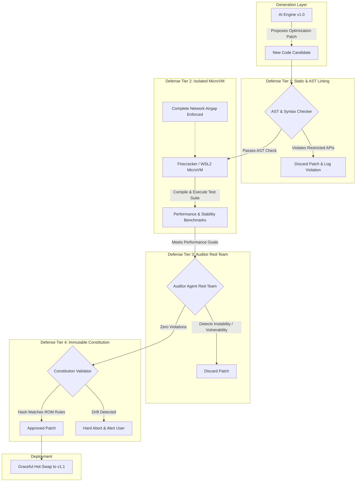

# Recursive Self-Improvement (RSI) Safety Specification

## 1. Introduction & Theoretical Foundation

**Recursive Self-Improvement (RSI)** refers to the theoretical and engineering process by which an artificial intelligence system iteratively analyzes, optimizes, and rewrites its own codebase. When an AI possesses state-of-the-art coding abilities, it can theoretically enhance its algorithmic efficiency, latency, and reasoning capability without human intervention.

However, an unconstrained self-modifying system presents existential and operational risks to the host machine:
* **Host System Compromise**: Defective code could accidentally delete user files, overwrite master boot records, or corrupt storage.
* **Runaway Loops**: Unbounded self-optimization can lead to catastrophic memory exhaustion or freeze host CPU cores.
* **Intent Drift**: Across dozens of self-update generations, subtle semantic shifts can erode original user alignment, leading the system to optimize for unintended objectives.

This specification defines the strict, non-negotiable architectural guardrails governing all self-modification within **Personal Agentic AI**.

---

## 2. The Four Pillars of Containment

### 2.1 Defense Tier 1: Static AST & API Whitelisting
Before any generated code is permitted to execute or compile, it is passed through an Abstract Syntax Tree (AST) analyzer:
* **Banned Calls**: Direct access to host filesystem root paths, registry modifications, raw hardware write registers, and unencrypted external sockets is statically blocked.
* **Memory Limits**: All memory allocations must enforce strict upper bounds (e.g., maximum buffer sizes).

### 2.2 Defense Tier 2: MicroVM Hardware Isolation & Network Airgap
All candidate code is compiled and tested inside an ephemeral **MicroVM** (e.g., Firecracker or an isolated hypervisor container):
* **Hardware Containment**: The VM is assigned a maximum ceiling of 2 CPU cores and 2GB RAM. If a candidate algorithm causes an infinite loop or memory leak, the host OS is completely unaffected.
* **Strict Network Airgap**: The virtual NIC is disconnected during testing. The candidate code has zero access to the internet, preventing any external data leakage or unauthorized connections.
* **Instant Tear-down**: Following benchmark execution, the MicroVM instance is destroyed cleanly.

### 2.3 Defense Tier 3: Dual-Agent Adversarial Auditing
Self-modification is never evaluated by the same cognitive instance that generated it:
1. **The Generator Agent**: Identifies algorithmic bottlenecks and authors the optimization patch.
2. **The Auditor Agent**: A mathematically conservative, separate agent instance tasked solely with "breaking" the new code. It applies extreme edge-case fuzzing inputs and verifies that output semantics match the previous version.

### 2.4 Defense Tier 4: Immutable Safety Constitution & Intent Drift Prevention
To prevent intent drift across hundreds of iterative updates:
* **The Constitution**: A set of core operational rules (e.g., "Always prioritize user privacy", "Never execute unverified network payloads", "Never bypass containment sandboxes").
* **Read-Only Lock (ROM)**: The cryptographic hash of the Constitution is compiled directly into the binary's read-only memory segment. During every self-update cycle, the new binary must verify that its cryptographic hash matches the immutable master key. If any modification to the Constitution is detected, the update is instantly aborted.
* **⚠️ Weakness found in review**: on a normal PC there is no true ROM. A program that can rewrite its own binary can rewrite the embedded hash (and the checker) too. The hash is therefore only a *tripwire*; the real guarantee must come from an **external trust anchor** — see §5 and ADR-005.

---

## 3. The Hot-Swap Lifecycle

When a code update passes all four tiers:
1. The new binary is compiled in the sandbox and output as a staging executable (`pai_core_vNext.exe`).
2. The current active process (`pai_core.exe`) is notified via IPC.
3. In-flight requests are completed; ephemeral memory is scrubbed.
4. Process handover occurs smoothly via parent-child process handoff.
5. The older binary is archived to a rollback directory for instant emergency reversion.

---

## 4. Implementation Status (2026-10-07)

| Tier | Status |
|------|--------|
| Tier 0 — untrusted-input handling (web data, prompt injection) | Prototyped in `research/data_verifier.py` + `net_guard.py` (see `THREAT_MODEL.md` T1–T4) |
| Tier 1 — static AST allow-list | Prototyped in `research/ast_guard.py` (import allow-list, forbidden builtins, dunder ban, size caps); unit-tested |
| Tier 2 — MicroVM + airgap | Isolation checklist implemented as code for Windows Sandbox (`research/sandbox_policy.py`, ADR-003): config generator + fail-closed validator + hostile-output reader; smoke test passed 7/7 on the owner's Windows host (`docs/evidence/sandbox_results.json`); the RSI launch-and-collect pipeline is Phase 4 |
| Tier 3 — Auditor agent | Not started |
| Tier 4 — Constitution | Redesigned (ADR-005): text in `CONSTITUTION.md`; hash pinned in the updater's trust root; externally signed releases; `research/updater.py` + `sign_release.py` prototyped and tested |

**Capability layer (new, ADR-006)**: `research/capabilities.py` limits what a hijacked reasoner can do (deny-by-default grants, taint tracking, human confirmation, audit chain).

**Tier 0 (new)**: before any data influences reasoning or code generation it passes URL policy, byte caps, sanitisation and injection screening. Web content must never be able to become an instruction to the Generator.

## 5. Known Weaknesses & Required Hardening

*Status of the items below: 2, 3, 7 have implemented prototypes (ADR-005, ADR-003); 1, 4, 5, 6 remain open design obligations for Phase 4.*

1. **AST filters are not sandboxes.** Python/Rust static filters are bypassable (dunder tricks, encoding, reflection). Tier 1 only removes the obvious; Tier 2 is the real boundary. No design decision may rely on Tier 1 alone.
2. **No true ROM for the Constitution** (see §2.4 note). **Prototyped (ADR-005).** Required: releases signed with a private key that never exists on the machine where the AI runs; verification done by a *separate updater process* with its own privilege level, which the engine cannot modify; optional TPM/secure-boot anchoring.
3. **Firecracker is Linux/KVM-only.** **Decided (ADR-003): Windows Sandbox primary.** On Windows use WSL2 (nested virtualisation), a Hyper-V VM with the NIC removed, or Windows Sandbox with networking disabled. Containers alone are insufficient. Decide in the Phase 4 ADR.
4. **"Formal verification" must be scoped.** Prove narrow properties (bounded memory, no forbidden syscalls, I/O contract) and use differential testing against the previous version; do not claim the whole behaviour is proven.
5. **Auditor independence.** If Generator and Auditor are the same model with the same blind spots they fail together: use a different model or prompt lineage, plus non-AI checks (fuzzers, sanitizers, property tests).
6. **Intent drift needs a metric.** Define a fixed regression suite of behavioural tests that every candidate must pass unchanged; the Constitution is checked by that suite as well as by hash.
7. **Update rate limiting.** Cap the number of self-updates per period and require human approval for the first N generations.

## 6. Model and adapter promotion (ADR-008)

Changing the *weights* the assistant relies on is a self-modification just like changing code, so it passes the same gates:
1. Candidate is built from verified, taint-filtered, locally generated data only (private data only with explicit opt-in).
2. Candidate must beat the current router on frozen coding evaluations by a pre-registered margin, must not be worse on the prompt-injection/file-analysis suites, and must not regress the Singlish intent evaluation.
3. Candidate ships as a signed release through the updater (ADR-005); the previous version is kept for rollback.
4. Rate limit and human approval for the first N promotions (see §5, item 7).
Evaluation sets are frozen and never used for training. A failed gate leaves the previous configuration untouched.
