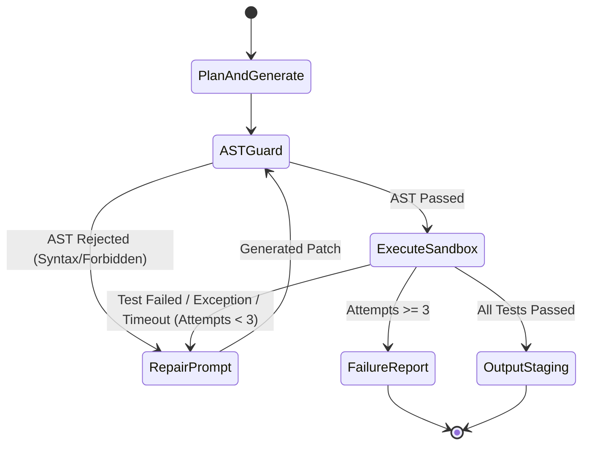

# ADR-011 — Restricted Execution Sandbox & Verify Loop Architecture for Generated Code

**Status:** Proposed (Milestone M2 requirement) · **Owner decision D8 (pending confirmation)** · **Date:** 2026-10-07

## Context
Milestone M2 introduces the automated coding workflow: `pai code "<task>" --out <dir>`. In this workflow, local language models (`qwen2.5-coder:7b`, `qwen2.5-coder:1.5b`) generate Python implementation code and companion unit tests, followed by execution in a verify-and-repair loop (generate -> static inspect -> execute tests -> repair on failure -> write to disk).

Executing model-generated code on the user's workstation is an active execution hazard (Threat T16). Model-synthesized code may contain unintentional defects (infinite loops, unbounded memory consumption, fork bombs) or hallucinated/malicious system calls (deleting host user files, exfiltrating credentials over sockets, spawning unauthorized child processes, invoking low-level C libraries).

In Milestone M1.1, the evaluation bake-off used a prototype runner (`research/safe_code_runner.py`) that relied on Python-level monkey-patching (`socket.socket = _blocked_socket`), unbuffered `-I -B` subprocesses, and a wall-clock timeout. While effective for grading cooperative benchmarks, Python-level monkey-patching is **not an OS security boundary**: untrusted code can bypass Python monkey-patches via `importlib.reload(socket)`, `ctypes`, `subprocess`, or direct OS system calls.

Milestone M2 requires a robust **defense-in-depth** containment architecture with an operating-system-enforced boundary.

## Decisions

### 1. Multi-Tier Containment Architecture
Generated code passes through four sequential gates:
```
AI Output ──► [Tier 1: AST Guard] ──► [Tier 2: OS Restricted Sandbox] ──► [Tier 3: Test Grader] ──► [Safe Staging]
```
If any tier rejects or times out, the repair loop is triggered or execution fails closed.

### 2. Tier 1: Static AST Guard
Before any process is spawned, the code is parsed via Python's `ast` module. The AST guard enforces:
1. **Forbidden Module Imports**: Immediate rejection if imports include `ctypes`, `subprocess`, `socket`, `http`, `urllib`, `requests`, `multiprocessing`, `threading`, `shutil`, `winreg`, `msvcrt`, `fcntl`, `posix`, `resource`, `signal`, `pty`, `builtins`, `importlib`.
2. **Forbidden Builtins & Attributes**: Immediate rejection of dynamic execution hooks (`eval`, `exec`, `compile`, `__import__`, `breakpoint`, `globals`, `locals`, `getattr`, `setattr`, `delattr`).
3. **Filesystem Path Screening**: String literals passed to `open()` or file APIs containing absolute paths (`/`, `C:\`) or directory traversal tokens (`..`) are rejected.
4. **Syntax Conformance**: Syntax errors fail static validation instantly, returning a structured line/column error to the repair loop without spawning a process.

### 3. Tier 2: OS-Level Sandbox Boundary (Restricted Runner)
Untrusted code is executed inside a heavily restricted child process. Monkey-patching is replaced or backed by OS kernel primitives:

#### Windows Host Boundary
On Windows, the runner binds the child process tree to a dedicated Windows Job Object and restricts token integrity:
1. **Job Objects (`JOBOBJECT_EXTENDED_LIMIT_INFORMATION`)**:
   - `JOB_OBJECT_LIMIT_KILL_ON_JOB_CLOSE`: If the parent PAI process crashes, closes, or terminates, the kernel immediately terminates every process in the job tree.
   - `JOB_OBJECT_LIMIT_PROCESS_MEMORY` & `JOB_OBJECT_LIMIT_JOB_MEMORY`: Hard ceiling of 512 MB. Allocations exceeding this limit immediately raise `MemoryError` without affecting the host.
   - `JOB_OBJECT_LIMIT_ACTIVE_PROCESS`: Limit to **1 active process**. Any attempt to fork or spawn child processes (`os.system`, `subprocess`, Win32 `CreateProcess`) fails with access denied, neutralizing fork bombs.
   - `JOB_OBJECT_LIMIT_DIE_ON_UNHANDLED_EXCEPTION`: Disables Windows Error Reporting dialogs on crashes or access violations.
2. **Token Integrity Level**:
   - Spawns the worker with a **Low Integrity SID** (`SECURITY_MANDATORY_LOW_RID`). Under Windows Mandatory Integrity Control (MIC), low-integrity processes cannot write to medium- or high-integrity user directories, Desktop, registry hives, or host files.
   - Restricted Token: Strips administrative privileges and removes write SIDs.

#### Linux Host Boundary
On Linux hosts (including WSL2 and CI runners), the runner uses POSIX resource limits and Linux kernel namespaces:
1. **Network Namespace (`CLONE_NEWNET`)**:
   - Process is launched inside a detached network namespace where the network interface is unconfigured (loopback is down, physical interfaces are detached). Network socket creation (`socket.socket`) fails with `Network is unreachable` or `Permission denied` at the kernel level.
2. **POSIX Resource Limits (`setrlimit` / `prlimit`)**:
   - `RLIMIT_AS`: Virtual address space cap (512 MB). Exceeding this triggers immediate `MemoryError`.
   - `RLIMIT_CPU`: Hard CPU time limit (5 seconds). Infinite loops are killed with `SIGXCPU` / `SIGKILL`.
   - `RLIMIT_NPROC`: Process limit set to 0 or 1, preventing `os.fork()` and neutralizing fork bombs.
   - `RLIMIT_FSIZE`: File creation size capped at 1 MB.
   - `RLIMIT_NOFILE`: Open file descriptor cap (max 32).

#### Execution Environment Hygiene
1. Invoked strictly as `sys.executable -I -B -s -S` (isolated mode, ignoring user site-packages, environment variables, and skipping bytecode compilation).
2. Clean ephemeral scratch directory created per execution run (`tempfile.TemporaryDirectory`).
3. Scrubbed environment: `PATH` minimized or emptied, `HOME` and `USERPROFILE` redirected to the scratch directory, sensitive variables (`SSH_*`, `AWS_*`, `GITHUB_*`, API keys) scrubbed completely.
4. Standard streams (`stdout`, `stderr`) are capped at 64 KB. Excessive output is truncated to prevent pipe buffer deadlocks.

### 4. Tier 3: Test Grader & Hidden Test Isolation
1. Untrusted solution code is placed in `solution.py`.
2. The test harness and assertions are managed in a separate evaluation module. The solution code cannot inspect parent call stacks or monkey-patch the grading test assertions.
3. Execution outcomes are normalized into structured JSON status records: `{"status": "ok" | "test_failure" | "timeout" | "memory_limit" | "ast_violation" | "error", "details": ...}`.

### 5. Bounded Verify-and-Repair State Machine
The repair loop is bounded to at most **3 iterations** ($N = 3$):

1. **Feedback Extraction**: Captures only the failing test name, exception type, line number in `solution.py`, and sanitized assertion diff. Secrets, full stack traces, and system file paths are omitted.
2. **Differential Repair Prompt**: Instructs the model to fix the specific failing condition while keeping existing logic intact.
3. **Termination**: If attempt 3 does not pass all tests, the loop terminates with a non-zero exit status and prints an actionable failure diagnostic.

### 6. Safe Output Staging (`--out <dir>`)
1. **Refusal to Overwrite**: If `<dir>` already contains existing files with identical names, `pai code` refuses to overwrite and aborts fail-closed, unless the user explicitly passes `--overwrite`.
2. **Atomic Writing**: Solution files are written to a temporary staging file (`.<filename>.tmp`) within `<dir>`, verified, and atomically replaced (`os.replace`).

### 7. Router Integration & Quality Evaluation
1. Integrates with `ModelRouter` using task class `code`. Selects candidate (`qwen2.5-coder:7b` on adequate RAM/AC, `qwen2.5-coder:1.5b` under RAM pressure or battery constraints).
2. Evaluated on the frozen 20-task coding suite (`research/eval_sets/coding_benchmark_v1.json`, SHA-256 verified) measuring pass@1 vs pass@3 with repair.

## Consequences
- Requires platform-specific sandbox dispatch (Win32 Job Objects on Windows; namespaces/prlimit on Linux).
- Protects workstation integrity against runaway loops, memory exhaustion, fork bombs, and accidental file modifications.
- Windows Sandbox full VM (ADR-003) remains available as Tier-4 defense if kernel Job Object isolation is insufficient.
- Unfalsifiable security claims remain strictly prohibited (`docs/THREAT_MODEL.md` §5).

## Alternatives Considered
- *In-process `exec` with restricted `globals`*: Rejected. Easily bypassed via Python introspections, `__subclasses__()`, and builtins.
- *Pure Python monkey-patching (`socket.socket = None`)*: Rejected. Does not prevent C extensions, `importlib.reload`, or direct syscalls.
- *Docker / Full Virtual Machine for every test run*: Rejected for M2 local latency (spin-up overhead > 2–5s per repair attempt). Full VM is retained for heavy batch workflows (ADR-003).

## If Reversed
Revert to the M1.1 subprocess runner with explicit notice that code execution is not an OS security boundary.
